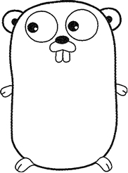

## 项目简介
* 这是一套帮助初学者从0到1学习go语言的项目，致力于打造最完整、最强悍、最有深度的Go语言学习体系
* 我希望这套课程能够涵盖Go语言的所有体系、并致力于用大量的案例来诠释其用法
* 鉴于作者水平有限，真诚地希望能够集所有人的智慧，完善此项目。

## 简介
* Go（又称Golang）是Google开发的一种静态强类型、编译型、并发型，并具有垃圾回收功能的编程语言。
* 罗伯特·格瑞史莫(Robert Griesemer)，罗勃·派克（Rob Pike）及肯·汤普逊(Ken Thompson)于2007年9月开始设计Go
* 稍后Ian Lance Taylor、Russ Cox加入项目。Go是基于Inferno操作系统所开发的。
* Go于2009年11月正式宣布推出，成为开放源代码项目，支持Linux、macOS、Windows等操作系统
* 在2016年，Go被软件评价公司TIOBE 选为“TIOBE 2016 年最佳语言”。
* 此外，很多重要的开源项目都是使用Go语言开发的，其中包括 Docker、Go-Ethereum、Thrraform 和 Kubernetes。

## 基本语言的历史
* 1960年 Ken Thompson(肯.汤普森) 发明了B语言
* 1972年 Dennis Ritchie(丹尼斯·里奇)发明了C语言
* 1982年 Bjarne Stroustrup(本贾尼)发明了C++语言
* 1989年 Guido von Rossum 发明了Python语言
* 1995年SUN公司发明了Java语言
* 2007年Go语言诞生
* 2009年的11月对外正式发布

## Go语言创始人
对语言进行评估时，明白设计者的动机以及语言要解决的问题很重要。Go语言出自 Ken Thompson 和 Rob Pike、Robert Griesemer 之手，他们都是计算机科学领域的重量级人物。
* Ken Thompson
贝尔实验室 Unix 团队成员，C语言、Unix 和 Plan 9 的创始人之一，在 20 世纪 70 年代，设计并实现了最初的 UNIX 操作系统，仅从这一点说，他对计算机科学的贡献怎么强调都不过分。他还与 Rob Pike 合作设计了 UTF-8 编码方案。
* Rob Pike
Go语言项目总负责人，贝尔实验室 Unix 团队成员，除帮助设计 UTF-8 外，还帮助开发了分布式多用户操作系统 Plan 9、Inferno 操作系统和 Limbo 编程语言，并与人合著了《The Unix Programming Environment》，对 UNIX 的设计理念做了正统的阐述。
* Robert Griesemer
就职于 Google，参与开发 Java HotSpot 虚拟机，对语言设计有深入的认识，并负责 Chrome 浏览器和 Node.js 使用的 Google V8 JavaScript 引擎的代码生成部分。

## go语言的继承
* Go语言有时候被描述为“C类似语言”，或者是“21世纪的C语言”。
* Go从C语言继承了相似的表达式语法、控制流结构、基础数据类型、调用参数传值、指针等思想，
* Go继承了C语言一直所看中的编译后机器码的运行效率以及和现有操作系统的无缝适配。
* Go语言的家族树中还有其它的祖先。其中一个有影响力的分支来自Niklaus Wirth所设计的Pascal语言。
* Modula-2语言激发了包的概念，然后Oberon语言摒弃了模块接口文件和模块实现文件之间的区别。第二代的Oberon-2语言直接影响了包的导入和声明的语法，还有Oberon语言的面向对象特性所提供的方法的声明语法等。
* Go语言的另一支祖先，带来了Go语言区别其他语言的重要特性，灵感来自于贝尔实验室的Tony Hoare于1978年发表的鲜为外界所知的关于并发研究的基础文献顺序通信进程（communicating sequential processes，缩写为CSP）。
    + 在CSP中，程序是一组中间没有共享状态的平行运行的处理过程，它们之间使用管道进行通信和控制同步。不过Tony Hoare的CSP只是一个用于描述并发性基本概念的描述语言，并不是一个可以编写可执行程序的通用编程语言。
    + Rob Pike和其他人开始不断尝试将CSP引入实际的编程语言中。他们第一次尝试引入CSP特性的编程语言叫Squeak（老鼠间交流的语言），是一个提供鼠标和键盘事件处理的编程语言，它的管道是静态创建的。
    + 然后是改进版的Newsqueak语言，提供了类似C语言语句和表达式的语法和类似Pascal语言的推导语法。Newsqueak是一个带垃圾回收的纯函数式语言，它再次针对键盘、鼠标和窗口事件管理。但是在Newsqueak语言中管道是动态创建的，属于第一类值,可以保存到变量中。
    + 在Plan9操作系统中，这些优秀的想法被吸收到了一个叫Alef的编程语言中。Alef试图将Newsqueak语言改造为系统编程语言，但是因为缺少垃圾回收机制而导致并发编程很痛苦。
    + 注：在Aelf之后还有一个叫Limbo的编程语言，Go语言从其中借鉴了很多特性。具体请参考Pike的讲稿：http://talks.golang.org/2012/concurrency.slide#9
* Go语言的其他的一些特性零散地来自于其他一些编程语言；比如iota语法是从APL语言借鉴，词法作用域与嵌套函数来自于Scheme语言和其他很多语言。
* Go中也有很多创新的设计，比如Go语言的切片为动态数组提供了有效的随机存取的性能，这可能会让人联想到链表的底层的共享机制。还有Go语言新发明的defer语句。

## go语言的特点
所有的编程语言都反映了语言设计者对编程哲学的反思，通常包括之前的语言所暴露的一些不足地方的改进。
* 简洁
    + Go项目是在Google公司维护超级复杂的几个软件系统遇到的一些问题的反思（但是这类问题绝不是Google公司所特有的）。
    + 正如Rob Pike所说，“软件的复杂性是乘法级相关的”，通过增加一个部分的复杂性来修复问题通常将慢慢地增加其他部分的复杂性。
    + 通过增加功能、选项、配置是修复问题的最快的途径，但是这很容易让人忘记简洁的内涵，卽使从长远来看，简洁依然是好软件的关键因素。
    + 简洁的设计需要在工作开始的时候舍弃不必要的想法，并且在软件的生命周期内严格区别好的改变或坏的改变。通过足够的努力，一个好的改变可以在不破坏原有完整概念的前提下保持自适应
    + 而一个坏的改变则不能达到这个效果，它们仅仅是通过肤浅的和简单的妥协来破坏原有设计的一致性。只有通过简洁的设计，才能让一个系统保持稳定、安全和持续的进化。
    + 附带了相关的工具和标准库
    + 没有隐式的数值转换
    + 没有构造函数和析构函数
    + 没有运算符重载
    + 没有默认参数
    + 没有继承
    + 没有泛型
    + 没有异常
    + 没有宏
    + 没有函数修饰
    + 没有线程局部存储。

* 基本特性
    + 自动垃圾回收
    + 包管理
    + 函数作为一等公民
    + 词法作用域
    + 系统调用接口
    + 只读的UTF8字符串
    + 函数多返回值
    + 匿名函数和闭包
    + 反射

* 向后兼容
    + Go语言本身是成熟和稳定的，而且承诺保证向后兼容：用之前的Go语言编写程序可以用新版本的Go语言编译器和标准库直接构建而不需要修改代码。
* 类型系统
    + 相比较于js、python，Go语言的类型系统避免动态语言中那些粗心的类型错误。但是Go语言的类型系统相比传统的强类型语言又要简洁很多，虽然有时候这会导致一个“无类型”的抽象类型的概念。
    + Go语言程序员并不需要像C++或Haskell程序员那样纠结于具体类型的安全属性。在实践中Go语言简洁的类型系统给了程序员带来了更多的安全性和更好的运行时性能。
    + Go语言鼓励当代计算机系统设计的原则，特别是局部的重要性。它的内置数据类型和大多数的标准数据结构都经过精心设计而避免显式的初始化或隐式的构造函数，因此内存分配和内存初始化代码被隐藏在库代码中了。
    + Go语言的聚合类型（结构体和数组）可以直接操作它们的元素，只需要更少的存储空间、更少的内存分配，而且指针操作比其他间接操作的语言也更有效率。
* 并发支持
    + 由于现代计算机是一个并行的机器，Go语言提供了基于CSP的并发特性支持。Go语言的动态栈使得轻量级线程goroutine的初始栈可以很小，因此创建一个goroutine的代价很小，创建百万级的goroutine完全是可行的。
* 强大的标准库与规范
    + Go语言的标准库，提供了清晰的构建模块和公共接口，包含I/O操作、文本处理、图像、密码学、网络和分布式应用程序等，并支持许多标准化的文件格式和编解码协议。
    + 库和工具使用了大量的约定来减少额外的配置和解释，从而最终简化程序的逻辑，而且每个Go程序结构都是如此的相似，因此Go程序也很容易学习。
    + Go语言自带工具构建Go语言项目只需要使用文件名和标识符名称, 以及少量的注释确定所有的库、可执行文件、测试、基准测试、案例、以及特定于平台的变量、项目的文档等；Go语言源代码本身就包含了构建规范。
* 开源,活跃的社区


## Go语言的优势
* 学习曲线容易
* 强大的标准库
* 自动垃圾回收机制
* 完整的软件生命周期工具
* 编译迅速


## 使用Go语言的公司
参见[世界上使用Go语言的企业](https://github.com/golang/go/wiki/GoUsers)
* Google
* Apple
* Cloud Foundry
* Docker
* 阿里云CDN
* 百度
* 小米
* 华为

## Go语言吉祥物
Go语言有一个吉祥物，在会议、文档页面和博文中，大多会包含下图所示的 Go Gopher，这是才华横溢的插画家 Renee French 设计的，她也是 Go 设计者之一 Rob Pike 的妻子。



## 参考资料
* [优秀的Go语言项目](https://github.com/avelino/awesome-go)
* [Bell Labs and CSP Threads](https://swtch.com/~rsc/thread/)
* [Go语言简介](http://c.biancheng.net/view/1.html)


```
go语言qq交流3群：713385260
emial:zhuimengshaonian04@gmail.com
```
