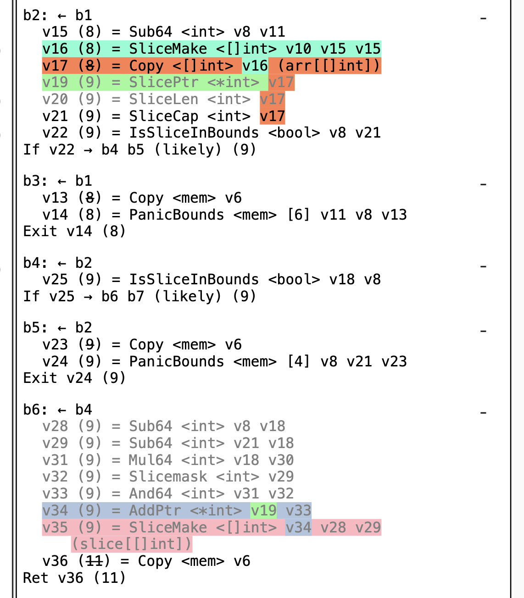
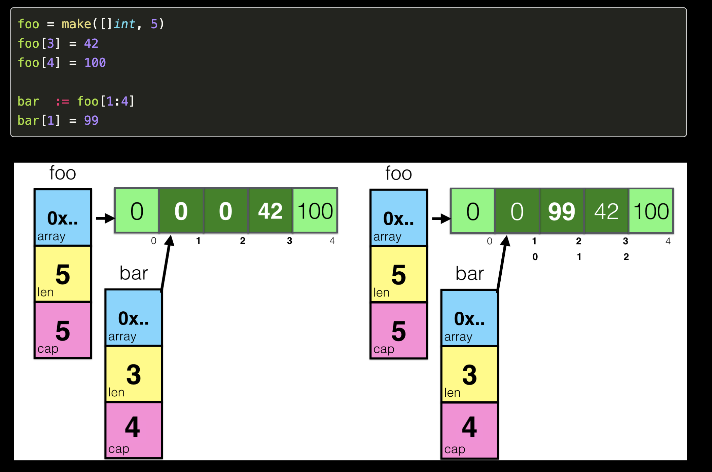

# golang快速入门[9.2]-精深奥妙的切片功夫

## 前言
下面这段程序会输出什么？
```
package main
import "fmt"
func f(s []string, level int) {
        if level > 5 {
               return
        }
        s = append(s, fmt.Sprint(level))
        f(s, level+1)
        fmt.Println("level:", level, "slice:", s)
}

func main() {
        f(nil, 0)
}
```
* 其输出为：
```
level: 5 slice: [0 1 2 3 4 5]
level: 4 slice: [0 1 2 3 4]
level: 3 slice: [0 1 2 3]
level: 2 slice: [0 1 2]
level: 1 slice: [0 1]
level: 0 slice: [0]
```

* 如果对输出结果有一些疑惑,你需要了解这篇文章的内容
* 如果你知道了结果,你仍然需要了解这篇文章的内容,因为本文完整介绍了
    + 切片的典型用法
    + 切片的陷阱
    + 切片的逃逸分析
    + 切片的扩容
    + 切片在编译与运行时的研究
* 如果你啥都知道了,请直接滑动最下方,双击666.

## 切片基本操作
* 切片是某种程度上和其他语言(例如C语言)中的`数组`在使用中有许多相似之处,但是go语言中的切片有许多独特之处
* Slice（切片）代表变长的序列，序列中每个元素都有相同的类型。
* 一个slice类型一般写作`[]T`，其中T代表slice中元素的类型；slice的语法和数组很像，但是没有固定长度。
* 数组和slice之间有着紧密的联系。一个slice是一个轻量级的数据结构，提供了访问数组子序列（或者全部）元素的功能。一个slice在运行时由三个部分构成：指针、长度和容量。
```
type SliceHeader struct {
	Data uintptr
	Len  int
	Cap  int
}
```
* 指针指向第一个slice元素对应的底层数组元素的地址
* 长度对应slice中元素的数目；长度不能超过容量
* 容量一般是从slice的开始位置到底层数据的结尾位置的长度

#### 切片的声明
```
//切片的声明1  //nil
var slice1 []int

//切片的声明2
var slice2 []int = make([]int,5)
var slice3 []int = make([]int,5,7)
numbers:= []int{1,2,3,4,5,6,7,8}
```

#### 切片的截取
```
numbers:= []int{1,2,3,4,5,6,7,8}
//从下标1一直到下标4，但是不包括下标4
numbers1 :=numbers[1:4]
//从下标0一直到下标3，但是不包括下标3
numbers2 :=numbers[:3]
//从下标3一直到结束
numbers3 :=numbers[3:]
```

#### 切片的长度与容量
* 内置的len和cap函数分别返回slice的长度和容量
```
    slice6 := make([]int,0)
    fmt.Printf("len=%d,cap=%d,slice=%v\n",len(slice4),cap(slice4),slice4)
```

#### 切片与数组的拷贝对比
* 数组的拷贝是副本拷贝。对于副本的改变不会影响到原来的数组
* 但是，切片的拷贝很特殊，切片的拷贝只是对于运行时切片结构体的拷贝,切片的副本仍然指向了相同的数组。所以，对于副本的修改会影响到原来的切片。
* 下面用一个简单的例子来说明
```
	//数组是值类型
	a := [4]int{1, 2, 3, 4}

	//切片是引用类型
	b := []int{100, 200, 300}

	c := a
	d := b

	c[1] = 200
	d[0] = 1
	//output: c[1 200 3 4] a[1 2 3 4]
	fmt.Println("a=", a, "c=", c)
	//output: d[1 200 300]  b[1 200 300]
	fmt.Println("b=", b, "d=", d)
```

#### 切片追加元素：append
```
numbers := make([]int, 0, 20)


//append一个元素
numbers = append(numbers, 0)

//append多个元素
numbers = append(numbers, 1, 2, 3, 4, 5, 6, 7)


//append添加切片
s1 := []int{100, 200, 300, 400, 500, 600, 700}
numbers = append(numbers, s1...)

//now:[0 1 2 3 4 5 6 7 100 200 300 400 500 600 700]

```


#### 经典案例: 切片删除
```
//	删除第一个元素
numbers = numbers[1:]

// 删除最后一个元素
numbers = numbers[:len(numbers)-1]

// 删除中间一个元素
a := int(len(numbers) / 2)
numbers = append(numbers[:a], numbers[a+1:]...)
```

## 切片在编译时的特性
* 编译时新建一个切片,切片内元素的类型是在编译期间确定的
```
func NewSlice(elem *Type) *Type {
	if t := elem.Cache.slice; t != nil {
		if t.Elem() != elem {
			Fatalf("elem mismatch")
		}
		return t
	}

	t := New(TSLICE)
	t.Extra = Slice{Elem: elem}
	elem.Cache.slice = t
	return t
}
```

* 切片的类型
```
// Slice contains Type fields specific to slice types.
type Slice struct {
	Elem *Type // element type
}

```

## 编译时：字面量初始化
当我们使用字面量 []int{1, 2, 3} 创建新的切片时，会创建一个array数组(`[3]int{1,2,3}`)存储于静态区中。同时会创建一个变量。
* 核心逻辑位于slicelit函数
```
// go/src/cmd/compile/internal/gc/sinit.go
func slicelit(ctxt initContext, n *Node, var_ *Node, init *Nodes)
```
其抽象的过程如下:
```
var vstat [3]int
vstat[0] = 1
vstat[1] = 2
vstat[2] = 3
var vauto *[3]int = new([3]int)
*vauto = vstat
slice := vauto[:]
```
* 源码中的注释如下：
```
// recipe for var = []t{...}
// 1. make a static array
//	var vstat [...]t
// 2. assign (data statements) the constant part
//	vstat = constpart{}
// 3. make an auto pointer to array and allocate heap to it
//	var vauto *[...]t = new([...]t)
// 4. copy the static array to the auto array
//	*vauto = vstat
// 5. for each dynamic part assign to the array
//	vauto[i] = dynamic part
// 6. assign slice of allocated heap to var
//	var = vauto[:]
```

## 编译时：make 初始化
* 例如`make([]int,3,4)`
* 使用`make` 关键字,在typecheck1类型检查阶段,节点Node的op操作变为`OMAKESLICE`,并且左节点存储长度3, 右节点存储容量4
```
func typecheck1(n *Node, top int) (res *Node) {
switch t.Etype {
case TSLICE:
    if i >= len(args) {
        yyerror("missing len argument to make(%v)", t)
        n.Type = nil
        return n
    }

    l = args[i]
    i++
    l = typecheck(l, ctxExpr)
    var r *Node
    if i < len(args) {
        r = args[i]
        i++
        r = typecheck(r, ctxExpr)
    }

    if l.Type == nil || (r != nil && r.Type == nil) {
        n.Type = nil
        return n
    }
    if !checkmake(t, "len", l) || r != nil && !checkmake(t, "cap", r) {
        n.Type = nil
        return n
    }
    n.Left = l
    n.Right = r
    n.Op = OMAKESLICE
```

* 下面来分析一下编译时内存的逃逸问题,如果make初始化了一个太大的切片，这个空间会逃逸到堆中,由运行时分配。如果一个空间比较小,会在栈中分配。
* 此临界值值定义在`/usr/local/go/src/cmd/compile/internal/gc`，可以被flag smallframes更新,默认为64KB。
* 所以`make([]int64,1023)` 与`make([]int64,1024)`的效果是截然不同的，这是不是压倒骆驼的最后一根稻草？

```
// maximum size of implicit variables that we will allocate on the stack.
	//   p := new(T)          allocating T on the stack
	//   p := &T{}            allocating T on the stack
	//   s := make([]T, n)    allocating [n]T on the stack
	//   s := []byte("...")   allocating [n]byte on the stack
	// Note: the flag smallframes can update this value.
	maxImplicitStackVarSize = int64(64 * 1024)
```

* 核心逻辑位于`go/src/cmd/compile/internal/gc/walk.go`，`n.Esc`代表变量是否逃逸
```
func walkexpr(n *Node, init *Nodes) *Node{
case OMAKESLICE:
    ...
    if n.Esc == EscNone {
        // var arr [r]T
        // n = arr[:l]
        i := indexconst(r)
        if i < 0 {
            Fatalf("walkexpr: invalid index %v", r)
        }
        t = types.NewArray(t.Elem(), i) // [r]T
        var_ := temp(t)
        a := nod(OAS, var_, nil) // zero temp
        a = typecheck(a, ctxStmt)
        init.Append(a)
        r := nod(OSLICE, var_, nil) // arr[:l]
        r.SetSliceBounds(nil, l, nil)
        r = conv(r, n.Type) // in case n.Type is named.
        r = typecheck(r, ctxExpr)
        r = walkexpr(r, init)
        n = r
    } else {
        if t.Elem().NotInHeap() {
            yyerror("%v is go:notinheap; heap allocation disallowed", t.Elem())
        }

        len, cap := l, r

        fnname := "makeslice64"
        argtype := types.Types[TINT64]

        m := nod(OSLICEHEADER, nil, nil)
        m.Type = t

        fn := syslook(fnname)
        m.Left = mkcall1(fn, types.Types[TUNSAFEPTR], init, typename(t.Elem()), conv(len, argtype), conv(cap, argtype))
        m.Left.SetNonNil(true)
        m.List.Set2(conv(len, types.Types[TINT]), conv(cap, types.Types[TINT]))

        m = typecheck(m, ctxExpr)
        m = walkexpr(m, init)
        n = m
    }

```
* 对上面代码具体分析，如果没有逃逸，分配在栈中。
* 抽象为：
```
arr := [r]T
ss := arr[:l]
```

* 如果发生了逃逸，运行时调用makeslice64或makeslice分配在堆中,当切片的长度和容量小于int类型的最大值，会调用makeslice,反之调用makeslice64创建切片。
* makeslice64最终也是调用了makeslice,比较简单，最后调用mallocgc申请的内存大小为`类型大小 * 容量cap`
```
// go/src/runtime/slice.go
func makeslice(et *_type, len, cap int) unsafe.Pointer {
	mem, overflow := math.MulUintptr(et.size, uintptr(cap))
	if overflow || mem > maxAlloc || len < 0 || len > cap {
		// NOTE: Produce a 'len out of range' error instead of a
		// 'cap out of range' error when someone does make([]T, bignumber).
		// 'cap out of range' is true too, but since the cap is only being
		// supplied implicitly, saying len is clearer.
		// See golang.org/issue/4085.
		mem, overflow := math.MulUintptr(et.size, uintptr(len))
		if overflow || mem > maxAlloc || len < 0 {
			panicmakeslicelen()
		}
		panicmakeslicecap()
	}

	return mallocgc(mem, et, true)
}

func makeslice64(et *_type, len64, cap64 int64) unsafe.Pointer {
	len := int(len64)
	if int64(len) != len64 {
		panicmakeslicelen()
	}

	cap := int(cap64)
	if int64(cap) != cap64 {
		panicmakeslicecap()
	}

	return makeslice(et, len, cap)
}

```

## 切片的扩容
* Go 中切片append表示添加元素,但不是使用了append就需要扩容,如下代码不需要扩容
```
a:= make([]int,3,4)
append(a,1)
```
* 当Go 中切片append当容量超过了现有容量,才需要进行扩容,例如：
```
a:= make([]int,3,3)
append(a,1)
```


* 核心逻辑位于`go/src/runtime/slice.go growslice函数`
```
func growslice(et *_type, old slice, cap int) slice {
    newcap := old.cap
	doublecap := newcap + newcap
	if cap > doublecap {
		newcap = cap
	} else {
		if old.len < 1024 {
			newcap = doublecap
		} else {

			for 0 < newcap && newcap < cap {
				newcap += newcap / 4
			}

			if newcap <= 0 {
				newcap = cap
			}
		}
	}
	...
}
```
* 上面的代码显示了扩容的核心逻辑,Go 中切片扩容的策略是这样的：
    + 首先判断，如果新申请容量（cap）大于2倍的旧容量（old.cap），最终容量（newcap）就是新申请的容量（cap）
    + 否则判断，如果旧切片的长度小于1024，则最终容量(newcap)就是旧容量(old.cap)的两倍，即（newcap=doublecap）
    + 否则判断，如果旧切片长度大于等于1024，则最终容量（newcap）从旧容量（old.cap）开始循环增加原来的1/4，即（newcap=old.cap,for {newcap += newcap/4}）直到最终容量（newcap）大于等于新申请的容量(cap)，即（newcap >= cap）
    + 如果最终容量（cap）计算值溢出，则最终容量（cap）就是新申请容量（cap）

* 接着根据切片类型的大小,确定不同的内存分配大小。其主要是用作内存的对齐。因此，申请的内存可能会大于实际的`et.size * newcap`
```
	switch {
	case et.size == 1:
		lenmem = uintptr(old.len)
		newlenmem = uintptr(cap)
		capmem = roundupsize(uintptr(newcap))
		overflow = uintptr(newcap) > maxAlloc
		newcap = int(capmem)
	case et.size == sys.PtrSize:
		lenmem = uintptr(old.len) * sys.PtrSize
		newlenmem = uintptr(cap) * sys.PtrSize
		capmem = roundupsize(uintptr(newcap) * sys.PtrSize)
		overflow = uintptr(newcap) > maxAlloc/sys.PtrSize
		newcap = int(capmem / sys.PtrSize)
	case isPowerOfTwo(et.size):
		var shift uintptr
		if sys.PtrSize == 8 {
			// Mask shift for better code generation.
			shift = uintptr(sys.Ctz64(uint64(et.size))) & 63
		} else {
			shift = uintptr(sys.Ctz32(uint32(et.size))) & 31
		}
		lenmem = uintptr(old.len) << shift
		newlenmem = uintptr(cap) << shift
		capmem = roundupsize(uintptr(newcap) << shift)
		overflow = uintptr(newcap) > (maxAlloc >> shift)
		newcap = int(capmem >> shift)
	default:
		lenmem = uintptr(old.len) * et.size
		newlenmem = uintptr(cap) * et.size
		capmem, overflow = math.MulUintptr(et.size, uintptr(newcap))
		capmem = roundupsize(capmem)
		newcap = int(capmem / et.size)
	}

```
* 最后核心是申请内存。要注意的是，新的切片不一定意味着新的地址。
* 根据切片类型`et.ptrdata`是否为指针,需要执行不同的逻辑。
```
	if et.ptrdata == 0 {
		p = mallocgc(capmem, nil, false)
		// The append() that calls growslice is going to overwrite from old.len to cap (which will be the new length).
		// Only clear the part that will not be overwritten.
		memclrNoHeapPointers(add(p, newlenmem), capmem-newlenmem)
	} else {
		// Note: can't use rawmem (which avoids zeroing of memory), because then GC can scan uninitialized memory.
		p = mallocgc(capmem, et, true)
		if lenmem > 0 && writeBarrier.enabled {
			// Only shade the pointers in old.array since we know the destination slice p
			// only contains nil pointers because it has been cleared during alloc.
			bulkBarrierPreWriteSrcOnly(uintptr(p), uintptr(old.array), lenmem)
		}
	}
	memmove(p, old.array, lenmem)

	return slice{p, old.len, newcap}
```

* 当切片类型不是指针,分配内存后只需要将内存的后面的值清空,`memmove(p, old.array, lenmem)` 函数用于将old切片的值赋值给新的切片
* 整个过程的抽象抽象表示如下
```
old = make([]int,3,3)
new = append(old,1) => new = malloc(newcap * sizeof(int))   a[4]  = 0
new[1] = old[1]
new[2] = old[2]
new[3] = old[3]
```
* 当切片类型为指针,指针需要写入当前协程缓冲区中,这个地方涉及到GC 回收机制中的写屏障,后面介绍。

## 切片的截取
* 对于数组下标的截取,如下所示，可以从多个维度证明,切片的截取生成了一个新的切片,但是底层数据源却是使用的同一个。
```
	old := make([]int64,3,3)
	new := old[1:3]
	fmt.Printf("%p %p",arr,slice)
```
输出为:
```
0xc000018140 0xc000018148
```
二者的地址正好相差了8个字节，这不是偶然的,而是因为二者指向了相同的数据源，刚好相差int64的大小。
另外我们也可以从生成的汇编的过程查看到到一些端倪
```
GOSSAFUNC=main GOOS=linux GOARCH=amd64 go tool compile main.go
```

在ssa的初始阶段`start`,make操作对应的是`SliceMake <[]int> v10 v15 v15`, 传递数组的指针、长度、容量。
而 `SliceMake <[]int> v34 v28 v29` 传递的指针v34正好的原始的Ptr + 8个字节的大小

下面列出一张图比较形象的表示切片引用相同数据源的图：


## 切片的复制
* 由于切片的复制不会改变指向的底层数据源。但是我们有些时候希望建一个新的数组，连底层数据源也是全新的。这个时候可以使用`copy`函数
* 切片进行值拷贝：copy
```
// 创建目标切片
numbers1 := make([]int, len(numbers), cap(numbers)*2)
// 将numbers的元素拷贝到numbers1中
count := copy(numbers1, numbers)
```

* 切片转数组
```
slice := []byte("abcdefgh")
var arr [4]byte
copy(arr[:], slice[:4])
//或者直接如下,这涉及到一个特性,即只会拷贝min(len(arr),len(slice)
copy(arr[:], slice)
```

* copy函数在编译时会决定使用哪一种方式，普通的方式会直接调用`memmove`
```
func copyany(n *Node, init *Nodes, runtimecall bool) *Node {
	...
	if runtimecall {
		if n.Right.Type.IsString() {
			fn := syslook("slicestringcopy")
			fn = substArgTypes(fn, n.Left.Type, n.Right.Type)
			return mkcall1(fn, n.Type, init, n.Left, n.Right)
		}

		fn := syslook("slicecopy")
		fn = substArgTypes(fn, n.Left.Type, n.Right.Type)
		return mkcall1(fn, n.Type, init, n.Left, n.Right, nodintconst(n.Left.Type.Elem().Width))
	}
    ...
    fn := syslook("memmove")
    fn = substArgTypes(fn, nl.Type.Elem(), nl.Type.Elem())
    nwid := temp(types.Types[TUINTPTR])
    setwid := nod(OAS, nwid, conv(nlen, types.Types[TUINTPTR]))
    ne.Nbody.Append(setwid)
    nwid = nod(OMUL, nwid, nodintconst(nl.Type.Elem().Width))
    call := mkcall1(fn, nil, init, nto, nfrm, nwid)
}

```
* 抽象表示为：
```
 init {
   n := len(a)
   if n > len(b) { n = len(b) }
   if a.ptr != b.ptr { memmove(a.ptr, b.ptr, n*sizeof(elem(a))) }
 }
```

* 除非是协程调用的方式`go copy(numbers1, numbers)` 或者（加入了race等检测 && 不是在编译go运行时代码） 会转而调用运行时slicestringcopy 或 slicecopy .

```
case OCOPY:
    n = copyany(n, init, instrumenting && !compiling_runtime)
case OGO:
    switch n.Left.Op {
    case OCOPY:
        n.Left = copyany(n.Left, &n.Ninit, true)

```

* slicestringcopy 或 slicecopy 本质上仍然是调用了`memmove`只是进行了额外的race冲突等判断。
```
func slicecopy(to, fm slice, width uintptr) int {
    ...
	if raceenabled {
		callerpc := getcallerpc()
		pc := funcPC(slicecopy)
		racewriterangepc(to.array, uintptr(n*int(width)), callerpc, pc)
		racereadrangepc(fm.array, uintptr(n*int(width)), callerpc, pc)
	}
	if msanenabled {
		msanwrite(to.array, uintptr(n*int(width)))
		msanread(fm.array, uintptr(n*int(width)))
	}

	size := uintptr(n) * width
	if size == 1 { // common case worth about 2x to do here
		// TODO: is this still worth it with new memmove impl?
		*(*byte)(to.array) = *(*byte)(fm.array) // known to be a byte pointer
	} else {
		memmove(to.array, fm.array, size)
	}
	return n
}

```

## 总结
* 切片是go语言中重要的数据结果,其和其他语言不同的是，其维护了底层的内存，以及长度和容量
* 切片与数组的赋值拷贝有明显区别,切片在赋值拷贝与下标截断时引用了相同的底层数据
* 如果要完全复制切片,使用`copy`函数。其逻辑是新建一个新的内存,并拷贝过去。在极端情况需要考虑其对性能的影响
* 切片字面量的初始化，数组存储于静态区。 切片`make`的初始化方式时,如果make初始化了一个大于64KB的切片，这个空间会逃逸到堆中,在运行时调用`makeslice`创建。小于64KB的切片在栈中初始化
* Go 中切片append当容量超过了现有容量,需要进行扩容,其策略是：
    + 首先判断，如果新申请容量（cap）大于2倍的旧容量（old.cap），最终容量（newcap）就是新申请的容量（cap）
    + 否则判断，如果旧切片的长度小于1024，则最终容量(newcap)就是旧容量(old.cap)的两倍，即（newcap=doublecap）
    + 否则判断，如果旧切片长度大于等于1024，则最终容量（newcap）从旧容量（old.cap）开始循环增加原来的1/4，即（newcap=old.cap,for {newcap += newcap/4}）直到最终容量（newcap）大于等于新申请的容量(cap)，即（newcap >= cap）
    + 如果最终容量（cap）计算值溢出，则最终容量（cap）就是新申请容量（cap）
* Go 中切片append后返回的切片地址并不一定是原来的、也不一定是新的内存地址,因此必须小心其可能遇到的陷阱。一般会使用`a = append(a,T)`的方式保证安全。

## 前文
* [golang快速入门[1]-go语言导论](https://zhuanlan.zhihu.com/p/107658283)
* [golang快速入门[2.1]-go语言开发环境配置-windows](https://zhuanlan.zhihu.com/p/107659334)
* [golang快速入门[2.2]-go语言开发环境配置-macOS](https://zhuanlan.zhihu.com/p/107661202)
* [golang快速入门[2.3]-go语言开发环境配置-linux](https://zhuanlan.zhihu.com/p/107662649)
* [golang快速入门[3]-go语言helloworld](https://zhuanlan.zhihu.com/p/107664129)
* [golang快速入门[4]-go语言如何编译为机器码](https://zhuanlan.zhihu.com/p/107665043)
* [golang快速入门[5.1]-go语言是如何运行的-链接器](https://zhuanlan.zhihu.com/p/107665658)
* [golang快速入门[5.2]-go语言是如何运行的-内存概述](https://zhuanlan.zhihu.com/p/107807229)
* [golang快速入门[5.3]-go语言是如何运行的-内存分配](https://zhuanlan.zhihu.com/p/108598942)
* [golang快速入门[6.1]-集成开发环境-goland详解](https://zhuanlan.zhihu.com/p/109564120)
* [golang快速入门[6.2]-集成开发环境-emacs详解](https://zhuanlan.zhihu.com/p/110003756)
* [golang快速入门[7.1]-项目与依赖管理-gopath](https://zhuanlan.zhihu.com/p/110526009)
* [golang快速入门[7.2]-北冥神功—go module绝技](https://zhuanlan.zhihu.com/p/111409419)
* [golang快速入门[8.1]-变量类型、声明赋值、作用域声明周期与变量内存分配](https://zhuanlan.zhihu.com/p/112513336)
* [golang快速入门[8.2]-自动类型推断的秘密](https://zhuanlan.zhihu.com/p/115085755)
* [golang快速入门[8.3]-深入理解浮点数](https://zhuanlan.zhihu.com/p/115888814)
* [golang快速入门[8.4]-常量与隐式类型转换](https://zhuanlan.zhihu.com/p/118316486)
* [golang快速入门[9.1]-深入数组用法、陷阱与编译时](https://zhuanlan.zhihu.com/p/126708324)

## 参考资料
* [项目链接](https://github.com/dreamerjackson/theWayToGolang)
* [作者知乎](https://www.zhihu.com/people/ke-ai-de-xiao-tu-ji-71)
* [blog](https://dreamerjonson.com/)
