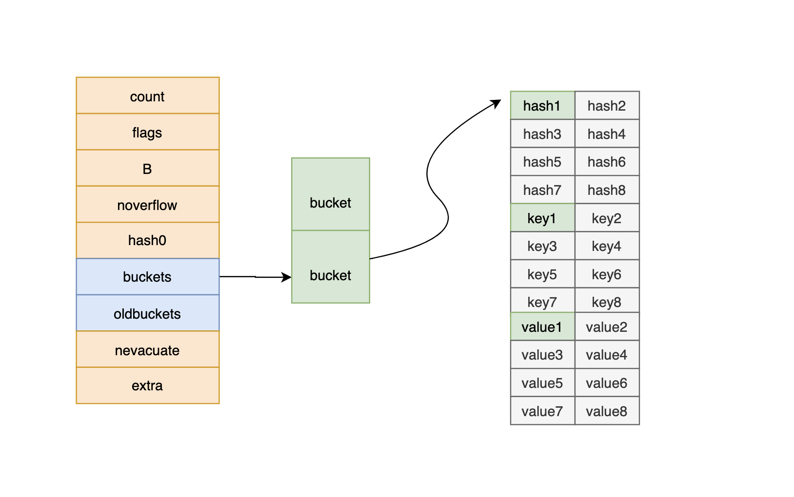
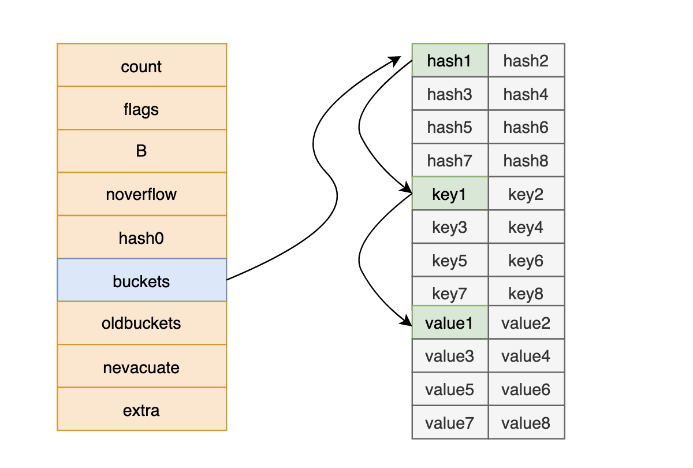
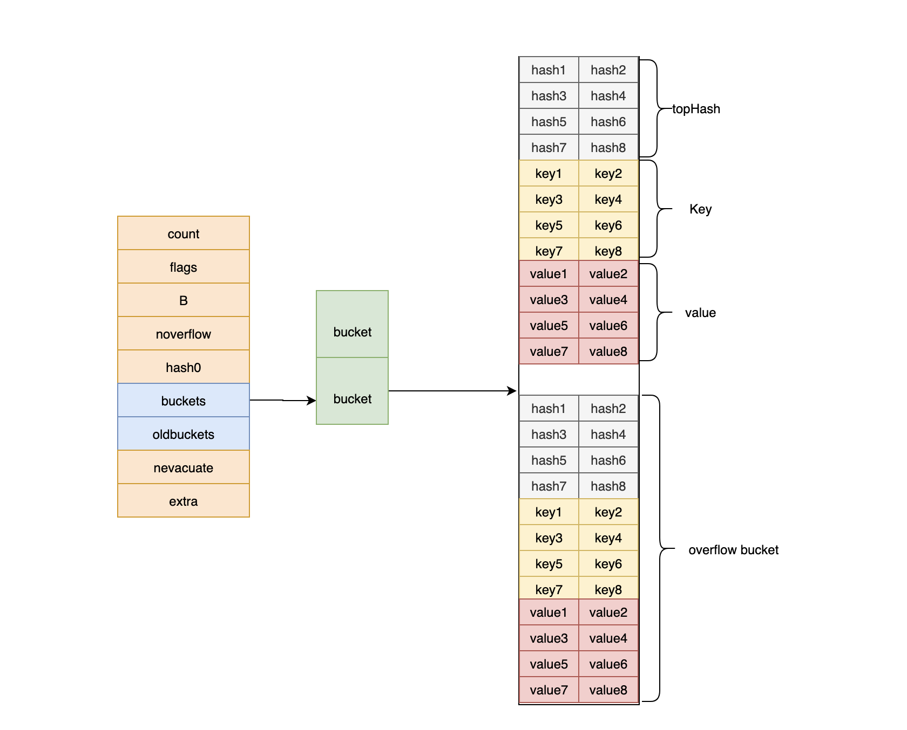
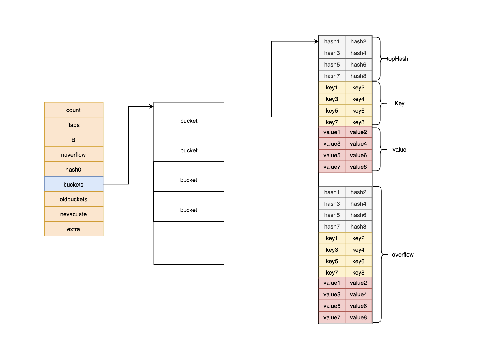
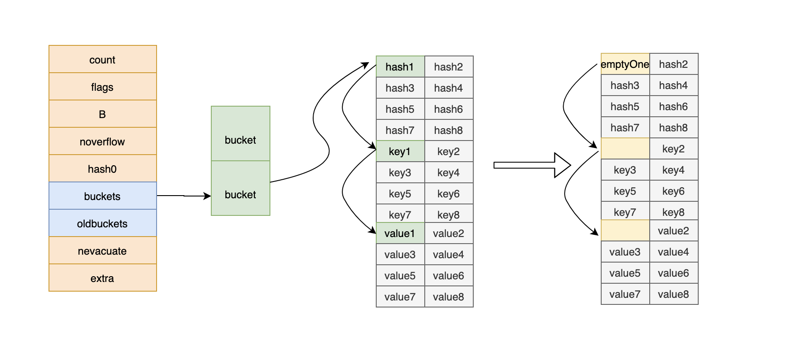
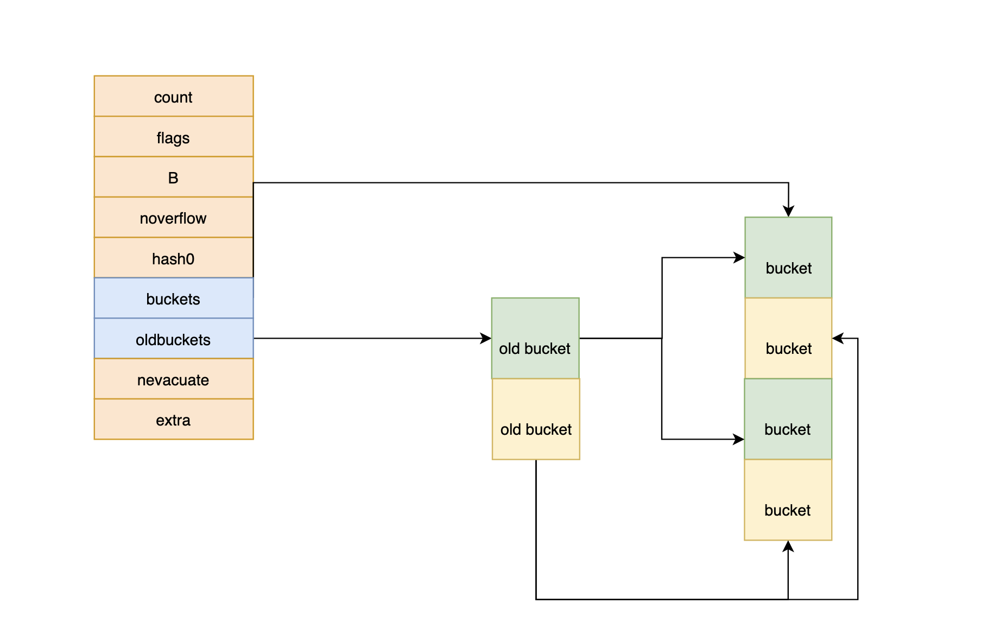
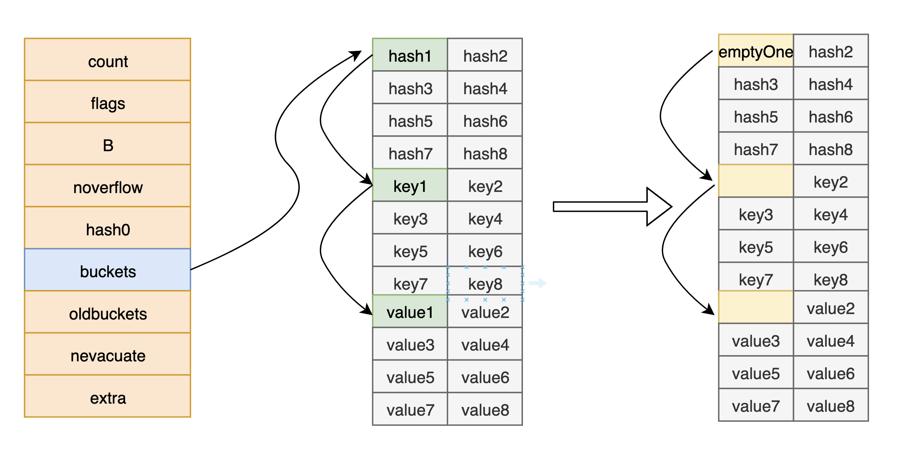
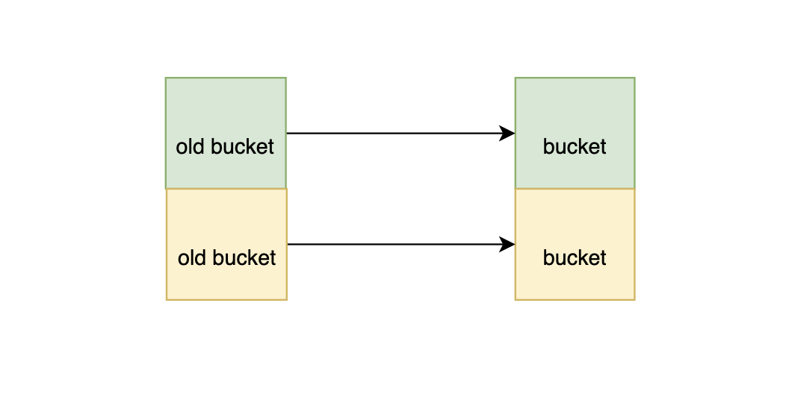

# 抽丝剥茧—Go哈希Map的鬼魅神功
* Go语言中的哈希Map是江湖上极厉害的一门武功,其入门简单，即便是掌握到了2、3层也具有四两拨千斤的神奇功效.因此成为江湖人士竞相研习的技艺，风头一时无两.
* 但即便是成名已久的高手,也鲜有能修炼到最高层的.
* 本文不仅介绍了哈希Map基本的使用方式,还深入源码介绍了哈希Map的至高心法.希望本文有助于你对Go哈希Map的理解臻于化境.
## 哈希表
* Go语言中的Map,又称为Hash map(哈希表)是使用频率极高的一种数据结构，重要程度高到令人发指。
* 哈希表的原理是将多个key/value对分散存储在buckets(桶)中。给定一个key，哈希算法会计算出键值对存储的位置。时常会通过两步完成,伪代码如图所示:
```
hash = hashfunc(key)
index = hash % array_size
```
* 在此伪代码中,第一步计算通过hash算法计算key的hash值,其结果与桶的数量无关。
* 接着通过执行取模运算得到`0 - array_size−1` 之间的index序号。
* 在实践中，我们时常将Map看做o(1)时间复杂度的操作,通过一个键key快速寻找其唯一对应的value。
## Map基本操作
### Map的声明与初始化
首先，来看一看map的基本使用方式。map声明的第一种方式如下
```
var hash  map[T]T
```
其并未对map进行初始化的操作,其值为nil,因此一旦进行`hash[key]=alue`这样的赋值操作就会报错。
```
panic(plainError("assignment to entry in nil map"))
```
比较意外的是Go语言允许对为nil的map进行访问:`hash["Go"]`,虽然其结果显然毫无意义.

map的第二种声明方式通过make进行。make的第二个参数中代表初始化创建map的长度。当NUMBER为空时，代表默认长度为0.
```
var hash = make(map[T]T,NUMBER)
```
此种方式可以正常的对map进行访问与赋值
在map初始化时，还具有字面量形式初始化的方式。其在创建map时即在其中添加了元素。
```
	var country = map[string]string{
		"China":  "Beijing",
		"Japan":  "Tokyo",
		"India":  "New Delhi",
		"France": "Paris",
		"Italy":  "Rome",
	}
    
    rating := map[string]float64{"c": 5, "Go": 4.5, "Python": 4.5, "C++": 3}
```

### Map的访问
map可以进行两种形式的访问:
```
 v  := hash[key]
```
以及
```
 v,ok := map[key]
```
当返回2个参数时，第2个参数代表当前key在map中是否存在。
不用惊讶于为什么同样的访问可以即返回一个值又返回两个值，这是在编译时做到的，后面会介绍。
### Map的赋值
map的赋值语法相对简单
```
hash[key] = value
```
其代表将value与给map1哈希表中的key绑定在一起
### Map的删除
map的删除需要用到delete，其是Go语言中的关键字，用于进行map的删除操作，形如:
```
delete(hash,key)
```
可以对相同的key进行多次的删除操作，而不会报错
## 关于map中的key
很容易理解,如果map中的key都没有办法比较是否相同,那么就不能作为map的key。
关于Go语言中的可比较性，直接阅读官方文档即可:`https://golang.org/ref/spec#Comparison_operators`
```
布尔值是可比较的。
整数值可比较
浮点值是可比较
复数值是可比较的。
字符串值是可比较
指针值是可比较的。如果两个指针值指向相同的变量，或者两个指针的值均为nil，则它们相等。
通道值是可比较的。如果两个通道值是由相同的make调用创建的，或者两个值都为nil。
接口值是可比较的。如果两个接口值具有相同的动态类型和相等的动态值，或者两个接口值都为nil，则它们相等。
如果结构的所有字段都是可比较的，则它们的值是可比较的。
如果数组元素类型的值可比较，则数组值可比较。如果两个数组的对应元素相等，则它们相等。
切片、函数、map是不可比较的。
```
## 关于map并发冲突问题
* 和其他语言有些不同的是，map并不支持并发的读写,因此下面的操作是错误的
```
	aa := make(map[int]int)
	go func() {
		for{
			aa[0] = 5
		}
	}()
	go func() {
		for{
			_ = aa[1]
		}
	}()
```
报错:
```
fatal error: concurrent map read and map write
```
* Go语言只支持并发的读取Map.因此下面的函数是没有问题的
```
	aa := make(map[int]int)
	go func() {
		for{
			_ = aa[2]
		}
	}()
	go func() {
		for{
			_ = aa[1]
		}
	}()
```
Go语言为什么不支持并发的读写，是一个频繁被提起的问题。我们可以在Go官方文档`Frequently Asked Questions`找到问题的答案（https://golang.org/doc/faq#atomic_maps）
```
Map被设计为不需要从多个goroutine安全访问，在实际情况下，Map可能是某些已经同步的较大数据结构或计算的一部分。
因此，要求所有Map操作都互斥将减慢大多数程序的速度，而只会增加少数程序的安全性。
```
即这样做的目的是为了大多数情况下的效率。
## Map在运行时
介绍了Map的基本操作,接下来介绍一下Map在运行时的行为。由于代码里面的逻辑关系关联比较复杂。首先用那个图片简单的梳理一下。
Go语言Map的底层实现如下所示:
```
// A header for a Go map.
type hmap struct {
	count     int // # live cells == size of map.  Must be first (used by len() builtin)
	flags     uint8
	B         uint8  // log_2 of # of buckets (can hold up to loadFactor * 2^B items)
	noverflow uint16 // approximate number of overflow buckets; see incrnoverflow for details
	hash0     uint32 // hash seed

	buckets    unsafe.Pointer // array of 2^B Buckets. may be nil if count==0.
	oldbuckets unsafe.Pointer // previous bucket array of half the size, non-nil only when growing
	nevacuate  uintptr        // progress counter for evacuation (buckets less than this have been evacuated)

	extra *mapextra // optional fields
}
```
其中：
* count 代表Map中元素的数量.
* flags 代表当前Map的状态（是否处于正在写入的状态等).
* B 对数形式表示的当前Map中桶的数量, 2^B = Buckets size.
* noverflow 为Map中溢出桶的数量.当溢出桶太多的时候，Map会进行`same-size map growth`.其实质是为了避免溢出桶过大导致的内存泄露问题.
* hash0 代表生成hash的随机数种子.
* buckets 指向了当前Map对应的桶的指针.
* oldbuckets 是在Map进行扩容的时候存储旧桶的.当所有的旧桶中的数据都已经转移到了新桶,则清空。
* nevacuate 在扩容的时候使用。用于标记当前旧桶中小于nevacuate的桶都已经转移到了新桶.

代表桶的`bmap`结构在运行时只列出了其首个字段: 即一个固定长度为8的数组。此字段顺序存储key的哈希值的前8位.
```
type bmap struct {
	tophash [bucketCnt]uint8
}
```
可能会有疑问，桶中存储的key和value值哪里去了？ 这是因为Map在编译时即确定了map中key,value,桶的大小。因此在运行时仅仅通过指针操作即可找到特定位置的元素。
桶本身在存储的tophash字段之后，会存储key数组以及value数组
```
type bmap struct {
	tophash [bucketCnt]uint8
    key   [bucketCnt]T
    value [bucketCnt]T
    ....
}
```

Go语言选择将key与value分开存储而不是key/value/key/value的形式，是为了在字节对齐的时候能够压缩空间。

在进行`hash[key]`此类的的Map访问操作时，会首先找到桶的位置，如下为伪代码操作.
```
hash = hashfunc(key)
index = hash % array_size
```
接着遍历tophash数组,如果数组中找到了相同的hash,那么就可以接着通过指针的寻址操作找到key与value值



* 在Go语言中还有一个溢出桶的概念,在执行`hash[key] = value`赋值操作时,当指定桶中的数据超过了8个，并不会直接就新开辟一个新桶,而是会将数据放置到溢出桶中每个桶的最后还存储了`overflow` 即溢出桶的指针

* 在正常情况下，数据是很少会跑到溢出桶里面去的。同理，我们也可以知道，在Map的查找操作时，如果key的hash在指定桶的tophash数组中不存在，还会遍历溢出桶中的数据。


* 后面我们会看到，如果一开始初始化map的数量比较大。则map提前创建好一些溢出桶存储在`extra *mapextra` 字段.
```
type mapextra struct {
	overflow    *[]*bmap
	oldoverflow *[]*bmap
	nextOverflow *bmap
}

```
这样当出现溢出现象是，就可以用提前创建好的桶而不用申请额外的内存空间。当预分配的溢出桶使用完了，溢出桶才会新建。

当发生以下两种情况之一，map会进行重建：
* 当Map超过了负载因子大小
* 当溢出桶的数量过多


在哈希表中都有负载因子的概念
```
负载因子 = 哈希表中元素数量 / 桶的数量
```

* 因此随着负载因子的增大，意味着越多的元素会分配到同一个桶中。此时其效率会减慢。
* 试想如果桶的数量只有1个，此时负载因子到达最大,此时的搜索效率就成了遍历数组。在Go语言中的负载因子为6.5。 
* 当超过了其大小后，Mpa会进行扩容，增大两倍于旧表的大小。
* 旧桶的数据会首先存到`oldbuckets` 字段，并想办法分散的转移到新桶中。




* 当旧桶的数据全部转移到新桶之后,旧桶数据即会被清空。

* map的重建还存在第二种情况，即溢出桶的数量太多。这时只会新建和原来的map具有相同大小的桶。进行这样`same size`的重建为了是防止溢出桶的数量可能缓慢增长导致的内存泄露.

* 当进行map的delete操作时, 和赋值操作类似，会找到指定的桶，如果存在指定的key,那么就释放掉key与value引用的内存。同时tophash中指定位置会存储`emptyOne`,代表当前位置是空的。

* 同时在删除操作时，会探测到是否当前要删除的元素之后都是空的。如果是，tophash会存储为`emptyRest`. 这样做的好处是在做查找操作时，遇到emptyRest 可以直接退出，因为后面的元素都是空的。



## Map深入
明白了Map的抽象原理，接下来看一下Map的具体实现。
### Map深入: make初始化
如果我们使用make关键字初始化Map,在typecheck1类型检查阶段,节点Node的op操作变为`OMAKEMAP`,如果指定了make map的长度,则会将长度常量值类型转换为TINT类型.如果未指定长度，则长度为0。`nodintconst(0)`
```
func typecheck1(n *Node, top int) (res *Node) {
        ...
		case TMAP:
			if i < len(args) {
				l = args[i]
				i++
				l = typecheck(l, ctxExpr)
				l = defaultlit(l, types.Types[TINT])
				if l.Type == nil {
					n.Type = nil
					return n
				}
				if !checkmake(t, "size", l) {
					n.Type = nil
					return n
				}
				n.Left = l
			} else {
				n.Left = nodintconst(0)
			}
			n.Op = OMAKEMAP
```
* 如果make的第二个参数不是整数，则会在类型检查时报错。
```
if !checkmake(t, "size", l) {
	    n.Type = nil
		return n
}

func checkmake(t *types.Type, arg string, n *Node) bool {
	if !n.Type.IsInteger() && n.Type.Etype != TIDEAL {
		yyerror("non-integer %s argument in make(%v) - %v", arg, t, n.Type)
		return false
	}
}

```


* 最后会指定在运行时调用runtime.makemap*函数
```go
func walkexpr(n *Node, init *Nodes) *Node {
           fnname := "makemap64"
			argtype := types.Types[TINT64]
			// Type checking guarantees that TIDEAL hint is positive and fits in an int.
			// See checkmake call in TMAP case of OMAKE case in OpSwitch in typecheck1 function.
			// The case of hint overflow when converting TUINT or TUINTPTR to TINT
			// will be handled by the negative range checks in makemap during runtime.
			if hint.Type.IsKind(TIDEAL) || maxintval[hint.Type.Etype].Cmp(maxintval[TUINT]) <= 0 {
				fnname = "makemap"
				argtype = types.Types[TINT]
			}
			fn := syslook(fnname)
			fn = substArgTypes(fn, hmapType, t.Key(), t.Elem())
			n = mkcall1(fn, n.Type, init, typename(n.Type), conv(hint, argtype), h)
}
```

不管是makemap64还是makemap,最后都调用了makemap函数
```
func makemap64(t *maptype, hint int64, h *hmap) *hmap {
	if int64(int(hint)) != hint {
		hint = 0
	}
	return makemap(t, int(hint), h)
}
```
* 保证创建map的长度不能超过int大小
```
if int64(int(hint)) != hint {
		hint = 0
}
```

* makemap函数会计算出需要的桶的数量,即log2(N),并调用`makeBucketArray`函数生成桶和溢出桶
* 如果初始化时生成了溢出桶,会放置到map的`extra`字段里去
```
func makemap(t *maptype, hint int, h *hmap) *hmap {
    ...
    B := uint8(0)
	for overLoadFactor(hint, B) {
		B++
	}
	h.B = B

	if h.B != 0 {
		var nextOverflow *bmap
		h.buckets, nextOverflow = makeBucketArray(t, h.B, nil)
		if nextOverflow != nil {
			h.extra = new(mapextra)
			h.extra.nextOverflow = nextOverflow
		}
	}

	return h
}

```
* makeBucketArray 会为Map申请内存大小，这里需要注意的是，如果map的数量大于了`2^4`，则会在初始化的时候生成溢出桶。溢出桶的大小为2^(b-4),b为桶的大小。
```
func makeBucketArray(t *maptype, b uint8, dirtyalloc unsafe.Pointer) (buckets unsafe.Pointer, nextOverflow *bmap) {
	if b >= 4 {
		nbuckets += bucketShift(b - 4)
		sz := t.bucket.size * nbuckets
		up := roundupsize(sz)
		if up != sz {
			nbuckets = up / t.bucket.size
		}
	}

	if dirtyalloc == nil {
		buckets = newarray(t.bucket, int(nbuckets))
	} else {
		buckets = dirtyalloc
		size := t.bucket.size * nbuckets
		if t.bucket.ptrdata != 0 {
			memclrHasPointers(buckets, size)
		} else {
			memclrNoHeapPointers(buckets, size)
		}
	}

	if base != nbuckets {
		nextOverflow = (*bmap)(add(buckets, base*uintptr(t.bucketsize)))
		last := (*bmap)(add(buckets, (nbuckets-1)*uintptr(t.bucketsize)))
		last.setoverflow(t, (*bmap)(buckets))
	}
	return buckets, nextOverflow
}

```
### Map深入: 字面量初始化
如果是采取了字面量初始化的方式，其最终任然是需要转换为`make`操作,其长度是字面量的长度。其编译时的核心逻辑位于:
```
func anylit(n *Node, var_ *Node, init *Nodes){
    ...
case OMAPLIT:
		if !t.IsMap() {
			Fatalf("anylit: not map")
		}
		    maplit(n, var_, init)

}

func maplit(n *Node, m *Node, init *Nodes) {
	a := nod(OMAKE, nil, nil)
	a.Esc = n.Esc
	a.List.Set2(typenod(n.Type), nodintconst(int64(n.List.Len())))
    if len(entries) > 25 {
        ...
    }
    ...
}
```
* 唯一值得一提的是,如果字面量的个数大于25个,编译时会构建一个数组循环添加
```
entries := n.List.Slice()
if len(entries) > 25 {
    // loop adding structure elements to map
	// for i = 0; i < len(vstatk); i++ {
	//	map[vstatk[i]] = vstate[i]
	// }
}
```
* 如果字面量的个数小于25个,编译时会指定会采取直接添加的方式赋值
```
for _, r := range entries {
    map[key] = value
}
```
### Map深入: map访问
前面介绍过,对map的访问，具有两种形式。一种是返回单个值
```
v := hash[key]
```
一种是返回多个返回值
```
v, ok := hash[key]
```
Go语言没有函数重载的概念，决定返回一个值还是两个值很明显只能够在编译时完成。
对于 `v:= rating["Go"]`
rating["Go"]会在编译时解析为一个node，其中左边type为ONAME,存储名字:,右边type为OLITERAL,存储"Go",节点的op为"OINDEXMAP"
根据`hash[key]` 位于赋值号的左边或右边，决定要执行访问还是赋值的操作。访问操作会在运行时调用运行mapaccess1_XXX函数,赋值操作会在运行时调用mapassign_XXX函数.

```
if n.IndexMapLValue() {
			// This m[k] expression is on the left-hand side of an assignment.
			fast := mapfast(t)
			if fast == mapslow {
				// standard version takes key by reference.
				// orderexpr made sure key is addressable.
				key = nod(OADDR, key, nil)
			}
			n = mkcall1(mapfn(mapassign[fast], t), nil, init, typename(t), map_, key)
		} else {
			// m[k] is not the target of an assignment.
			fast := mapfast(t)
			if fast == mapslow {
				// standard version takes key by reference.
				// orderexpr made sure key is addressable.
				key = nod(OADDR, key, nil)
			}

			if w := t.Elem().Width; w <= 1024 { // 1024 must match runtime/map.go:maxZero
				n = mkcall1(mapfn(mapaccess1[fast], t), types.NewPtr(t.Elem()), init, typename(t), map_, key)
			} else {
				z := zeroaddr(w)
				n = mkcall1(mapfn("mapaccess1_fat", t), types.NewPtr(t.Elem()), init, typename(t), map_, key, z)
			}
		}
```

* Go编译器根据map中的key类型和大小选择不同的mapaccess1_XXX函数进行加速,但是他们在查找逻辑上都是相同的
```
func mapfast(t *types.Type) int {
	// Check runtime/map.go:maxElemSize before changing.
	if t.Elem().Width > 128 {
		return mapslow
	}
	switch algtype(t.Key()) {
	case AMEM32:
		if !t.Key().HasHeapPointer() {
			return mapfast32
		}
		if Widthptr == 4 {
			return mapfast32ptr
		}
		Fatalf("small pointer %v", t.Key())
	case AMEM64:
		if !t.Key().HasHeapPointer() {
			return mapfast64
		}
		if Widthptr == 8 {
			return mapfast64ptr
		}
		// Two-word object, at least one of which is a pointer.
		// Use the slow path.
	case ASTRING:
		return mapfaststr
	}
	return mapslow
}

```

```
func mkmapnames(base string, ptr string) mapnames {
	return mapnames{base, base + "_fast32", base + "_fast32" + ptr, base + "_fast64", base + "_fast64" + ptr, base + "_faststr"}
}

var mapaccess1 = mkmapnames("mapaccess1", "")

```
最终会在运行时会调用mapaccess1_XXXX的函数。

而对于`v, ok := hash[key]`类型的map访问则有所不同。在编译时的op操作为OAS2MAPR.会将其转换为在运行时调用的mapaccess2_XXXX前缀的函数。其伪代码如下:
```
		//   var,b = mapaccess2*(t, m, i)
		//   v = *var
```
* 需要注意，如果采用`_, ok := hash[key]`形式，则不用对第一个参数进行赋值操作.
* 在运行时,会根据key值以及hash种子 计算hash值:`alg.hash(key, uintptr(h.hash0)).`
* 接着bucketMask计算出当前桶的个数-1. `m := bucketMask(h.B)`
* Go语言采用了一种简单的方式`hash&m`计算出此key应该位于哪一个桶中.获取到桶的位置后，`tophash(hash)`即可计算出hash的前8位.
* 接着此hash 挨个与存储在桶中的tophash进行对比。如果有hash值相同的话.会找到其对应的key值，查看key值是否相同。如果key值也相同，即说明查找到了结果，返回value哦。
```
func mapaccess1(t *maptype, h *hmap, key unsafe.Pointer) unsafe.Pointer {
	alg := t.key.alg
	hash := alg.hash(key, uintptr(h.hash0))
	m := bucketMask(h.B)
	b := (*bmap)(add(h.buckets, (hash&m)*uintptr(t.bucketsize)))
	top := tophash(hash)
bucketloop:
	for ; b != nil; b = b.overflow(t) {
		for i := uintptr(0); i < bucketCnt; i++ {
			if b.tophash[i] != top {
				if b.tophash[i] == emptyRest {
					break bucketloop
				}
				continue
			}
			k := add(unsafe.Pointer(b), dataOffset+i*uintptr(t.keysize))
			if t.indirectkey() {
				k = *((*unsafe.Pointer)(k))
			}
			if alg.equal(key, k) {
				e := add(unsafe.Pointer(b), dataOffset+bucketCnt*uintptr(t.keysize)+i*uintptr(t.elemsize))
				if t.indirectelem() {
					e = *((*unsafe.Pointer)(e))
				}
				return e
			}
		}
	}
	return unsafe.Pointer(&zeroVal[0])
}
```
* 函数mapaccess2 的逻辑几乎是类似的，只是其会返回第二个参数，表明value值是否存在于桶中.
```
func mapaccess2(t *maptype, h *hmap, key unsafe.Pointer) (unsafe.Pointer, bool) {
	alg := t.key.alg
	hash := alg.hash(key, uintptr(h.hash0))
	m := bucketMask(h.B)
	b := (*bmap)(unsafe.Pointer(uintptr(h.buckets) + (hash&m)*uintptr(t.bucketsize)))
	top := tophash(hash)
bucketloop:
	for ; b != nil; b = b.overflow(t) {
		for i := uintptr(0); i < bucketCnt; i++ {
			if b.tophash[i] != top {
				if b.tophash[i] == emptyRest {
					break bucketloop
				}
				continue
			}
			k := add(unsafe.Pointer(b), dataOffset+i*uintptr(t.keysize))
			if t.indirectkey() {
				k = *((*unsafe.Pointer)(k))
			}
			if alg.equal(key, k) {
				e := add(unsafe.Pointer(b), dataOffset+bucketCnt*uintptr(t.keysize)+i*uintptr(t.elemsize))
				if t.indirectelem() {
					e = *((*unsafe.Pointer)(e))
				}
				return e, true
			}
		}
	}
	return unsafe.Pointer(&zeroVal[0]), false
}
```

### Map深入: 赋值操作
* 和访问的情况的比较类似, 最终会调用运行时mapassign*函数。
* 赋值操作，map必须已经进行了初始化。
```
    if h == nil {
		panic(plainError("assignment to entry in nil map"))
	}
```
* 同时要注意，由于Map不支持并发的读写操作，因此还会检测是否有协程在访问此Map,如果是，即会报错。
```
if h.flags&hashWriting != 0 {
	throw("concurrent map writes")
}
```

* 和访问操作一样,会计算key的hash值
```
	alg := t.key.alg
	hash := alg.hash(key, uintptr(h.hash0))
```
* 标记当前map已经是写入状态

```
	h.flags ^= hashWriting
```

* 如果当前没有桶，还会常见一个新桶。所以初始化的时候还是定一个长度吧。
```
if h.buckets == nil {
	h.buckets = newobject(t.bucket) // newarray(t.bucket, 1)
}
```

* 接着找到当前key对应的桶
```
	bucket := hash & bucketMask(h.B)
```

* 如果发现，当前的map正好在重建，还没有重建完。会优先完成重建过程，重建的细节后面会介绍。
```
    if h.growing() {
		growWork(t, h, bucket)
	}
``` 

* 计算tophash
```
	b := (*bmap)(unsafe.Pointer(uintptr(h.buckets) + bucket*uintptr(t.bucketsize)))
	top := tophash(hash)
```

* 开始寻找是否有对应的hash，如果找到了，判断key是否相同，如果相同，会找到对应的value的位置在后面进行赋值

```
for i := uintptr(0); i < bucketCnt; i++ {
			if b.tophash[i] != top {
				if isEmpty(b.tophash[i]) && inserti == nil {
					inserti = &b.tophash[i]
					insertk = add(unsafe.Pointer(b), dataOffset+i*uintptr(t.keysize))
					elem = add(unsafe.Pointer(b), dataOffset+bucketCnt*uintptr(t.keysize)+i*uintptr(t.elemsize))
				}
				if b.tophash[i] == emptyRest {
					break bucketloop
				}
				continue
			}
			k := add(unsafe.Pointer(b), dataOffset+i*uintptr(t.keysize))
			if t.indirectkey() {
				k = *((*unsafe.Pointer)(k))
			}
			if !alg.equal(key, k) {
				continue
			}
			// already have a mapping for key. Update it.
			if t.needkeyupdate() {
				typedmemmove(t.key, k, key)
			}
			elem = add(unsafe.Pointer(b), dataOffset+bucketCnt*uintptr(t.keysize)+i*uintptr(t.elemsize))
			goto done
		}
		ovf := b.overflow(t)
		if ovf == nil {
			break
		}
		b = ovf
	}

```
* 要注意的是,如果tophash没找到，还会去溢出桶里寻找是否存在指定的hash
* 如果也不存在，会选择往第一个空元素中插入数据inserti、insertk会记录此空元素的位置，
```
				if isEmpty(b.tophash[i]) && inserti == nil {
					inserti = &b.tophash[i]
					insertk = add(unsafe.Pointer(b), dataOffset+i*uintptr(t.keysize))
					elem = add(unsafe.Pointer(b), dataOffset+bucketCnt*uintptr(t.keysize)+i*uintptr(t.elemsize))
				}
```
* 在赋值之前，还需要判断Map是否需要重建
```
if !h.growing() && (overLoadFactor(h.count+1, h.B) || tooManyOverflowBuckets(h.noverflow, h.B)) {
		hashGrow(t, h)
		goto again // Growing the table invalidates everything, so try again
	}
```
* 没有问题后，就会执行最后的操作，将新的key与value值存入数组中
* 这里需要注意一点是,如果桶中已经没有了空元素。这时候我们申请一个新的桶给到这个桶。
```
	if inserti == nil {
		// all current buckets are full, allocate a new one.
		newb := h.newoverflow(t, b)
		inserti = &newb.tophash[0]
		insertk = add(unsafe.Pointer(newb), dataOffset)
		elem = add(insertk, bucketCnt*uintptr(t.keysize))
	}
```
* 申请的新桶一开始是来自于map中`extra`字段初始化时存储的多余溢出桶。如果这些多余的溢出桶都用完了才会申请新的内存。一个桶的溢出桶可能会进行延展


```
func mapassign(t *maptype, h *hmap, key unsafe.Pointer) unsafe.Pointer {
	var inserti *uint8
	var insertk unsafe.Pointer
	var elem unsafe.Pointer
bucketloop:
	for {
		

	// Did not find mapping for key. Allocate new cell & add entry.

	// If we hit the max load factor or we have too many overflow buckets,
	// and we're not already in the middle of growing, start growing.
	

	if inserti == nil {
		// all current buckets are full, allocate a new one.
		newb := h.newoverflow(t, b)
		inserti = &newb.tophash[0]
		insertk = add(unsafe.Pointer(newb), dataOffset)
		elem = add(insertk, bucketCnt*uintptr(t.keysize))
	}

	// store new key/elem at insert position
	if t.indirectkey() {
		kmem := newobject(t.key)
		*(*unsafe.Pointer)(insertk) = kmem
		insertk = kmem
	}
	if t.indirectelem() {
		vmem := newobject(t.elem)
		*(*unsafe.Pointer)(elem) = vmem
	}
	typedmemmove(t.key, insertk, key)
	*inserti = top
	h.count++

done:
	if h.flags&hashWriting == 0 {
		throw("concurrent map writes")
	}
	h.flags &^= hashWriting
	if t.indirectelem() {
		elem = *((*unsafe.Pointer)(elem))
	}
	return elem
}
```

### Map深入: Map重建
当发生以下两种情况之一，map会进行重建：
* 当Map超过了负载因子大小6.5
* 当溢出桶的数量过多
重建时需要调用hashGrow函数,如果是负载因子超载，会进行双倍重建。


```
	bigger := uint8(1)
	if !overLoadFactor(h.count+1, h.B) {
		bigger = 0
		h.flags |= sameSizeGrow
	}
```
* 当溢出桶的数量过多,则会进行等量重建。新桶会会存储到`buckets`字段,旧桶会存储到`oldbuckets`字段。
* map中extra字段的溢出桶也同理的进行了转移。
```

	if h.extra != nil && h.extra.overflow != nil {
		// Promote current overflow buckets to the old generation.
		if h.extra.oldoverflow != nil {
			throw("oldoverflow is not nil")
		}
		h.extra.oldoverflow = h.extra.overflow
		h.extra.overflow = nil
	}


```
* hashGrow 代码一览
```
func hashGrow(t *maptype, h *hmap) {
	// If we've hit the load factor, get bigger.
	// Otherwise, there are too many overflow buckets,
	// so keep the same number of buckets and "grow" laterally.
	bigger := uint8(1)
	if !overLoadFactor(h.count+1, h.B) {
		bigger = 0
		h.flags |= sameSizeGrow
	}
	oldbuckets := h.buckets
	newbuckets, nextOverflow := makeBucketArray(t, h.B+bigger, nil)

	flags := h.flags &^ (iterator | oldIterator)
	if h.flags&iterator != 0 {
		flags |= oldIterator
	}
	// commit the grow (atomic wrt gc)
	h.B += bigger
	h.flags = flags
	h.oldbuckets = oldbuckets
	h.buckets = newbuckets
	h.nevacuate = 0
	h.noverflow = 0

	if h.extra != nil && h.extra.overflow != nil {
		// Promote current overflow buckets to the old generation.
		if h.extra.oldoverflow != nil {
			throw("oldoverflow is not nil")
		}
		h.extra.oldoverflow = h.extra.overflow
		h.extra.overflow = nil
	}
	if nextOverflow != nil {
		if h.extra == nil {
			h.extra = new(mapextra)
		}
		h.extra.nextOverflow = nextOverflow
	}

	// the actual copying of the hash table data is done incrementally
	// by growWork() and evacuate().
}
```

* 要注意的是, 在这里并没有进行实际的将旧桶数据转移到新桶的过程。数据转移遵循了`copy on write`(写时复制)的规则。只有在真正赋值的时候，会选择是否需要进行数据转移。核心逻辑位于函数`growWork` and `evacuate`
```
	bucket := hash & bucketMask(h.B)
	if h.growing() {
		growWork(t, h, bucket)
	}
```

* 在进行写时复制的时候，意味着并不是所有的数据都会一次性的进行转移，而只会转移当前需要的这个旧桶。
 `bucket := hash & bucketMask(h.B)`得到了当前新桶所在的位置，而要转移的旧桶的位置位于`bucket&h.oldbucketmask()`
`xy [2]evacDst` 用于存储要转移到新桶的位置

如果是双倍重建,那么旧桶转移到新桶的位置总是相距旧桶的数量. 


如果是等量重建，则简单的直接转移即可



* 解决了旧桶要转移哪一些新桶，我们还需要解决旧桶中的数据要转移到哪一些新桶. 
* 其中有一个非常重要的原则是：如果此数据计算完hash后,`hash & bucketMask <= 旧桶的大小` 意味着这个数据必须转移到和旧桶位置完全对应的新桶中去.理由是现在当前key所在新桶的序号与旧桶是完全相同的。
```
    newbit := h.noldbuckets()
	if hash&newbit != 0 {
	    useY = 1
	}
```

```
func evacuate(t *maptype, h *hmap, oldbucket uintptr) {
    ...
    // Unlink the overflow buckets & clear key/elem to help GC.
		if h.flags&oldIterator == 0 && t.bucket.ptrdata != 0 {
			b := add(h.oldbuckets, oldbucket*uintptr(t.bucketsize))
			// Preserve b.tophash because the evacuation
			// state is maintained there.
			ptr := add(b, dataOffset)
			n := uintptr(t.bucketsize) - dataOffset
			memclrHasPointers(ptr, n)
		}
	}

	if oldbucket == h.nevacuate {
		advanceEvacuationMark(h, t, newbit)
	}
}
```

### Map深入: delete
* 删除的逻辑在之前介绍过，是比较简单的。
* 核心逻辑位于`func mapdelete(t *maptype, h *hmap, key unsafe.Pointer) `
* 同样需要计算出hash的前8位、指定的桶等。
* 同样会一直寻找是否有相同的key，如果找不到,会一直查找当前桶的溢出桶下去,知道到达末尾...
* 如果查找到了指定的key,则会清空数据，hash位设置为`emptyOne`. 如果发现后面没有元素，则会设置为`emptyRest`,并循环向上检查前一个元素是否为空。
```
			for {
				b.tophash[i] = emptyRest
				if i == 0 {
					if b == bOrig {
						break // beginning of initial bucket, we're done.
					}
					// Find previous bucket, continue at its last entry.
					c := b
					for b = bOrig; b.overflow(t) != c; b = b.overflow(t) {
					}
					i = bucketCnt - 1
				} else {
					i--
				}
				if b.tophash[i] != emptyOne {
					break
				}
			}
```
* delete代码一览
```
func mapdelete(t *maptype, h *hmap, key unsafe.Pointer) {
	alg := t.key.alg
	hash := alg.hash(key, uintptr(h.hash0))
	h.flags ^= hashWriting

	bucket := hash & bucketMask(h.B)
	if h.growing() {
		growWork(t, h, bucket)
	}
	b := (*bmap)(add(h.buckets, bucket*uintptr(t.bucketsize)))
	bOrig := b
	top := tophash(hash)
search:
	for ; b != nil; b = b.overflow(t) {
		for i := uintptr(0); i < bucketCnt; i++ {
			if b.tophash[i] != top {
				if b.tophash[i] == emptyRest {
					break search
				}
				continue
			}
			k := add(unsafe.Pointer(b), dataOffset+i*uintptr(t.keysize))
			k2 := k
			if t.indirectkey() {
				k2 = *((*unsafe.Pointer)(k2))
			}
			if !alg.equal(key, k2) {
				continue
			}
				if t.indirectkey() {
				*(*unsafe.Pointer)(k) = nil
			} else if t.key.ptrdata != 0 {
				memclrHasPointers(k, t.key.size)
			}
			e := add(unsafe.Pointer(b), dataOffset+bucketCnt*uintptr(t.keysize)+i*uintptr(t.elemsize))
			if t.indirectelem() {
				*(*unsafe.Pointer)(e) = nil
			} else if t.elem.ptrdata != 0 {
				memclrHasPointers(e, t.elem.size)
			} else {
				memclrNoHeapPointers(e, t.elem.size)
			}
			b.tophash[i] = emptyOne
				if i == bucketCnt-1 {
				if b.overflow(t) != nil && b.overflow(t).tophash[0] != emptyRest {
					goto notLast
				}
			} else {
				if b.tophash[i+1] != emptyRest {
					goto notLast
				}
			}
			for {
				b.tophash[i] = emptyRest
				if i == 0 {
					if b == bOrig {
						break // beginning of initial bucket, we're done.
					}
					c := b
					for b = bOrig; b.overflow(t) != c; b = b.overflow(t) {
					}
					i = bucketCnt - 1
				} else {
					i--
				}
				if b.tophash[i] != emptyOne {
					break
				}
			}
		notLast:
			h.count--
			break search
		}
	}
	if h.flags&hashWriting == 0 {
		throw("concurrent map writes")
	}
	h.flags &^= hashWriting
}
```

## 总结
* 本文介绍了Go语言Map的基本操作
* 介绍了Map使用中key的可比较性以及map并发冲突的设计原因
* 介绍了map在编译和运行时在初始化、访问、赋值、重建、删除、数据转移、哈希冲突时的一些细节
* see you~
