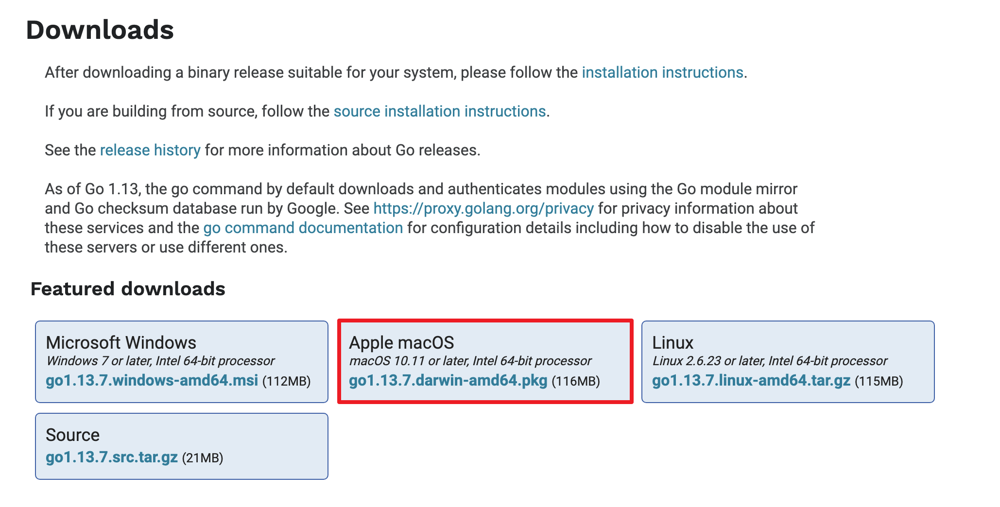
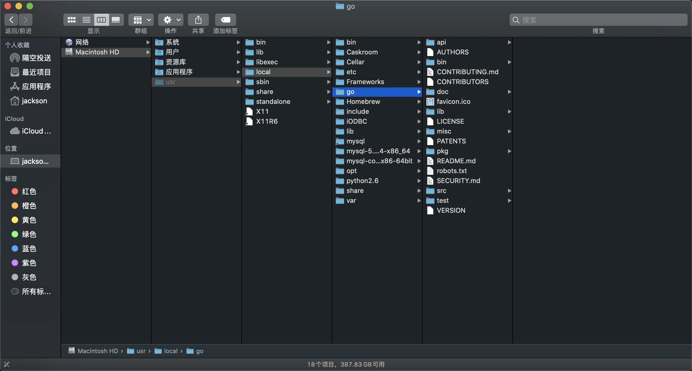

# golang快速入门[2.2]-go语言开发环境配置-macos
## macos安装Go语言开发包
* 配置go语言的开发环境的第一步是要在[go官网下载页面](https://golang.google.cn/dl/)
* macos需要下载pkg后缀文件，苹果公司制造的macOS和iOS操作系统Apple软件包使用.pkg扩展名,在内部使用Xar格式


* Mac OS 的Go语言开发包是 .pkg 格式的，双击我们下载的安装包即可开始安装,一路点击“继续”即可.


* 双击我们下载好的Go语言开发包即可启动安装程序，如下图所示，这是Go语言的用户许可协议，无需管它，直接勾选“I accept ...”然后点击“Next”即可。

* 安装包会默认安装在 /usr/local 目录下，如下所示。


* 这个目录的结构遵守 GOPATH 规则，后面的章节会提到这个概念。目录中各个文件夹的含义如下表所示。

| 目录名 | 说明                                                                  |
|--------|-----------------------------------------------------------------------|
| api    | 每个版本的 api 变更差异                                               |
| bin    | go 源码包编译出的编译器（go）、文档工具（godoc）、格式化工具（gofmt） |
| doc    | 英文版的 Go 文档                                                      |
| lib    | 引用的一些库文件                                                      |
| misc   | 杂项用途的文件，例如 Android 平台的编译、git 的提交钩子等             |
| pkg    | Windows 平台编译好的中间文件                                          |
| src    | 标准库的源码                                                          |
| test   | 测试用例                                                              |


* 安装完成之后，在终端运行 go version，如果显示类似下面的信息，表明安装成功。
```
» go version                                                                                                                                                                          jackson@192
go version go1.13.6 darwin/amd64
```

## 设置 GOPATH 环境变量
* 开始写 go 项目代码之前，需要我们先配置好环境变量。
* 编辑 ~/.bash_profile（在终端中运行 vim ~/.bash_profile 即可）来添加下面这行代码（如果你找不到 .bash_profile，那自己创建一个就可以了）
* 注意gopath的路径也是可以自己指定的，这里是$HOME/go
* 提示：$HOME 是每个电脑下的用户主目录，每个电脑可能不同，可以在终端运行 echo $HOME 获取

```
export GOPATH=$HOME/go
```
* 保存然后退出你的编辑器。然后在终端中运行下面命令，代表让上面的命令立即生效
```
source ~/.bash_profile
```
* GOROOT 也就是 Go 开发包的安装目录路径，默认环境变量会自动配置在 /usr/local/go。可以在 bash_profile 文件中设置。
```
export GOROOT=/usr/local/go
```
然后保存并退出编辑器，运行 `source ~/.bash_profile` 命令即可。


## 设置环境变量
* 开发包安装完成后，我们还需要配置一下GOPATH 环境变量，之后才可以使用Go语言进行开发。GOPATH 是一个路径，他是go开发的工作空间,用来存放开发中需要用到的代码包。
* 在桌面或者资源管理器右键“此电脑”（或者“我的电脑”）→“属性”→“高级系统设置”→“环境变量”，如下图所示。


* 在弹出的菜单里找到 GOPATH 对应的选项点击编辑之后就可以修改了，没有的话可以选择新建，并将变量名填写为 GOPATH，变量值设置为任意目录均可（尽量选择空目录），例如 D:\Go。


* 提示：填写完成后，每个打开的窗口都需要点击“确定”来保存设置。
* 其它的环境变量安装包均会进行自动设置。
* 环境变量设置好后，可以通过在命令行输入go env 命令来进行测试。
```
» go env                                                                                                                                                                              jackson@192
GO111MODULE=""
GOARCH="amd64"
GOBIN=""
GOCACHE="/Users/jackson/Library/Caches/go-build"
GOENV="/Users/jackson/Library/Application Support/go/env"
GOEXE=""
GOFLAGS=""
GOHOSTARCH="amd64"
GOHOSTOS="darwin"
GONOPROXY=""
GONOSUMDB=""
GOOS="darwin"
GOPATH="/Users/jackson/go"
GOPRIVATE=""
GOPROXY="direct"
GOROOT="/usr/local/go"
```
## 参考资料
* [在Mac OS上安装Go语言开发包](http://c.biancheng.net/view/3994.html)
