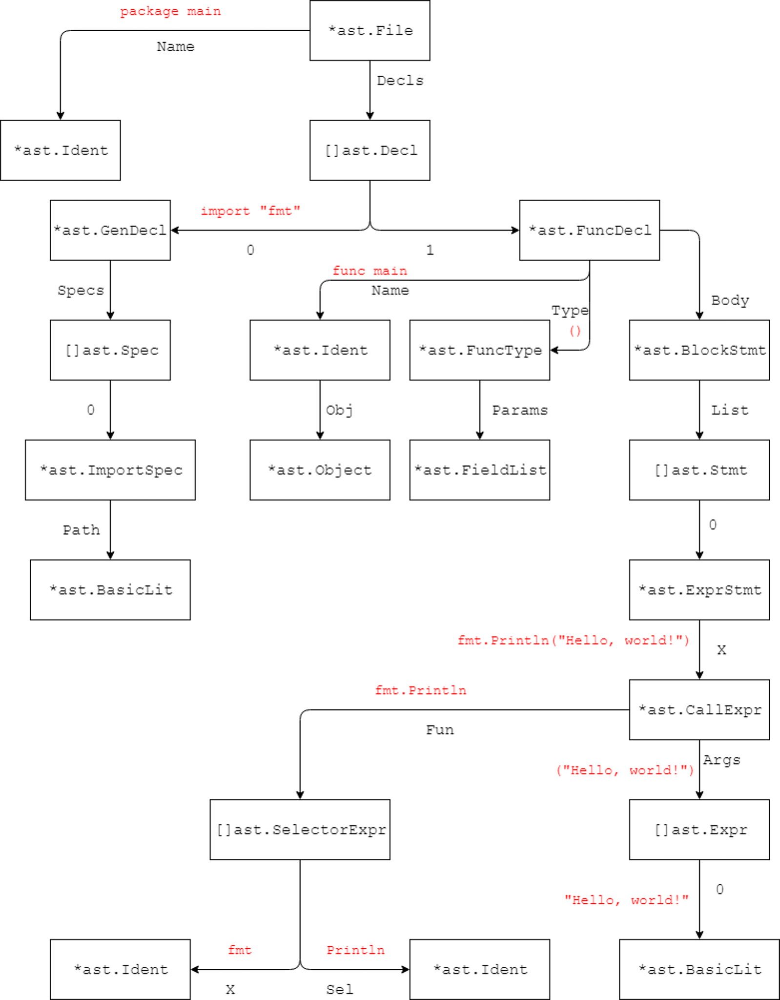
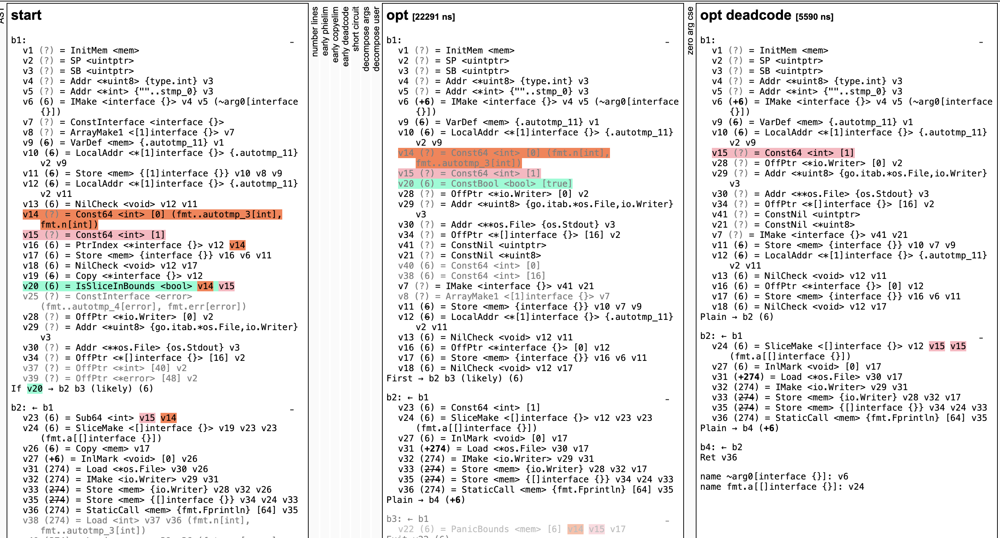
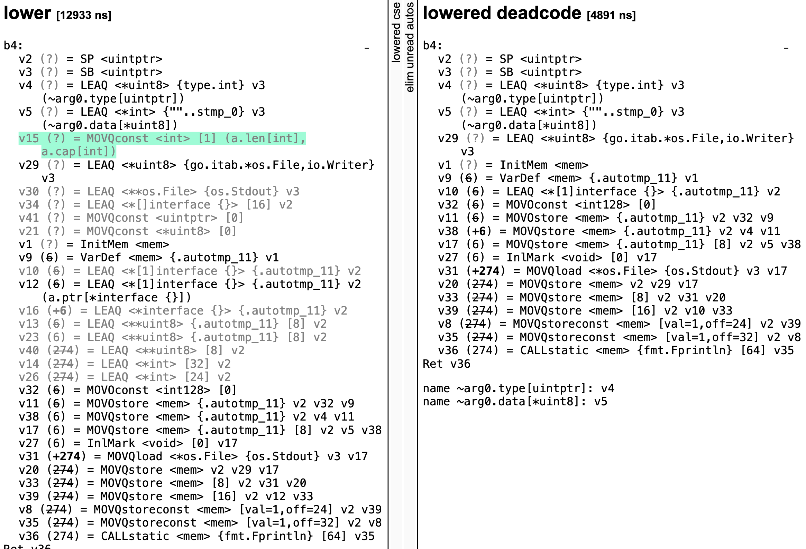

# golang快速入门[4]-go语言如何编译为机器码

## 前文
* [golang快速入门[2.1]-go语言开发环境配置-windows](https://zhuanlan.zhihu.com/p/105462515)
* [golang快速入门[2.2]-go语言开发环境配置-macOS](https://zhuanlan.zhihu.com/p/105551487)
* [golang快速入门[2.3]-go语言开发环境配置-linux](https://zhuanlan.zhihu.com/p/105556890)
* [golang快速入门[3]-go语言helloworld](https://zhuanlan.zhihu.com/p/105776462)

* 在上文中,我们详细介绍了第一个helloworld程序
```go
package main
import "fmt"
func main() {
	fmt.Println("Hello, world")
}
```
* 在本文中，我们将介绍初学者比较关心的话题：go语言如何编译为机器码
* 本文的目标是希望读者对go语言的编译过程有一个全面的理解
* 一段程序要运行起来，需要将go代码生成机器能够识别的二进制代码
* go代码生成机器码需要编译器经历：
    词法分析 => 语法分析 => 类型检查 =>  中间代码 => 代码优化 => 生成机器码
* Go语言的编译器入口是 `src/cmd/compile/internal/gc` 包中的 `main.go` 文件，此函数会先获取命令行传入的参数并更新编译的选项和配置
* 随后就会开始运行 parseFiles 函数对输入的所有文件进行词法与语法分析
```
func Main(archInit func(*Arch)) {
    // ...

    lines := parseFiles(flag.Args())
```
* 接下来我们将对各个阶段做深入介绍
## 词法分析
* 所有的编译过程都是从解析代码的源文件开始的
* 词法分析的作用就是解析源代码文件，它将文件中的字符串序列转换成`Token`序列，方便后面的处理和解析
* 我们一般会把执行词法分析的程序称为词法解析器（lexer）
* `Token`可以是关键字，字符串，变量名，函数名
* 有效程序的"单词"都由`Token`表示，具体来说，这意味着"package"，"main"，"func" 等单词都为`Token`
* Go语言允许我们使用go/scanner和go/token包在Go程序中执行解析程序，从而可以看到类似被编译器解析后的结构
* 如果在语法解析的过程中发生了任何语法错误，都会被语法解析器发现并将消息打印到标准输出上，整个编译过程也会随着错误的出现而被中止
* helloworld程序解析后如下所示
```
1:1   package "package"
1:9   IDENT   "main"
1:13  ;       "\n"
2:1   import  "import"
2:8   STRING  "\"fmt\""
2:13  ;       "\n"
3:1   func    "func"
3:6   IDENT   "main"
3:10  (       ""
3:11  )       ""
3:13  {       ""
4:3   IDENT   "fmt"
4:6   .       ""
4:7   IDENT   "Println"
4:14  (       ""
4:15  STRING  "\"Hello, world!\""
4:30  )       ""
4:31  ;       "\n"
5:1   }       ""
5:2   ;       "\n"
5:3   EOF     ""
```
* 我们可以看到，词法解析器添加了分号，分号常常是在C语言等语言中一条语句后添加的
* 这解释了为什么Go不需要分号：词法解析器可以智能地加入分号

## 语法分析
* 语法分析的输入就是词法分析器输出的 Token 序列，这些序列会按照顺序被语法分析器进行解析，语法的解析过程就是将词法分析生成的 Token 按照语言定义好的文法（Grammar）自下而上或者自上而下的进行规约，每一个 Go 的源代码文件最终会被归纳成一个 SourceFile 结构：
```
SourceFile = PackageClause ";" { ImportDecl ";" } { TopLevelDecl ";" }
```

* 标准的 Golang 语法解析器使用的就是 LALR(1) 的文法，语法解析的结果生成了抽象语法树（Abstract Syntax Tree，AST）
* 抽象语法树（Abstract Syntax Tree，AST），或简称语法树（Syntax tree），是源代码语法结构的一种抽象表示。它以树状的形式表现编程语言的语法结构，树上的每个节点都表示源代码中的一种结构。
* 之所以说语法是“抽象”的，是因为这里的语法并不会表示出真实语法中出现的每个细节。比如，嵌套括号被隐含在树的结构中，并没有以节点的形式呈现；而类似于 if-condition-then 这样的条件跳转语句，可以使用带有三个分支的节点来表示。
* 与AST相对应的是CST(Concrete Syntax Trees),读者可以在参考资料中拓展阅读二者的差别
* 在AST中，我们能够看到程序结构，例如函数和常量声明
* Go为我们提供了用于解析程序和查看AST的软件包：go/parser 和 go/ast
* helloworld程序生成的AST如下所示
```
     0  *ast.File {
     1  .  Package: 1:1
     2  .  Name: *ast.Ident {
     3  .  .  NamePos: 1:9
     4  .  .  Name: "main"
     5  .  }
     6  .  Decls: []ast.Decl (len = 2) {
     7  .  .  0: *ast.GenDecl {
     8  .  .  .  TokPos: 3:1
     9  .  .  .  Tok: import
    10  .  .  .  Lparen: -
    11  .  .  .  Specs: []ast.Spec (len = 1) {
    12  .  .  .  .  0: *ast.ImportSpec {
    13  .  .  .  .  .  Path: *ast.BasicLit {
    14  .  .  .  .  .  .  ValuePos: 3:8
    15  .  .  .  .  .  .  Kind: STRING
    16  .  .  .  .  .  .  Value: "\"fmt\""
    17  .  .  .  .  .  }
    18  .  .  .  .  .  EndPos: -
    19  .  .  .  .  }
    20  .  .  .  }
    21  .  .  .  Rparen: -
    22  .  .  }
    23  .  .  1: *ast.FuncDecl {
    24  .  .  .  Name: *ast.Ident {
    25  .  .  .  .  NamePos: 5:6
    26  .  .  .  .  Name: "main"
    27  .  .  .  .  Obj: *ast.Object {
    28  .  .  .  .  .  Kind: func
    29  .  .  .  .  .  Name: "main"
    30  .  .  .  .  .  Decl: *(obj @ 23)
    31  .  .  .  .  }
    32  .  .  .  }
    33  .  .  .  Type: *ast.FuncType {
    34  .  .  .  .  Func: 5:1
    35  .  .  .  .  Params: *ast.FieldList {
    36  .  .  .  .  .  Opening: 5:10
    37  .  .  .  .  .  Closing: 5:11
    38  .  .  .  .  }
    39  .  .  .  }
    40  .  .  .  Body: *ast.BlockStmt {
    41  .  .  .  .  Lbrace: 5:13
    42  .  .  .  .  List: []ast.Stmt (len = 1) {
    43  .  .  .  .  .  0: *ast.ExprStmt {
    44  .  .  .  .  .  .  X: *ast.CallExpr {
    45  .  .  .  .  .  .  .  Fun: *ast.SelectorExpr {
    46  .  .  .  .  .  .  .  .  X: *ast.Ident {
    47  .  .  .  .  .  .  .  .  .  NamePos: 6:2
    48  .  .  .  .  .  .  .  .  .  Name: "fmt"
    49  .  .  .  .  .  .  .  .  }
    50  .  .  .  .  .  .  .  .  Sel: *ast.Ident {
    51  .  .  .  .  .  .  .  .  .  NamePos: 6:6
    52  .  .  .  .  .  .  .  .  .  Name: "Println"
    53  .  .  .  .  .  .  .  .  }
    54  .  .  .  .  .  .  .  }
    55  .  .  .  .  .  .  .  Lparen: 6:13
    56  .  .  .  .  .  .  .  Args: []ast.Expr (len = 1) {
    57  .  .  .  .  .  .  .  .  0: *ast.BasicLit {
    58  .  .  .  .  .  .  .  .  .  ValuePos: 6:14
    59  .  .  .  .  .  .  .  .  .  Kind: STRING
    60  .  .  .  .  .  .  .  .  .  Value: "\"Hello, world!\""
    61  .  .  .  .  .  .  .  .  }
    62  .  .  .  .  .  .  .  }
    63  .  .  .  .  .  .  .  Ellipsis: -
    64  .  .  .  .  .  .  .  Rparen: 6:29
    65  .  .  .  .  .  .  }
    66  .  .  .  .  .  }
    67  .  .  .  .  }
    68  .  .  .  .  Rbrace: 7:1
    69  .  .  .  }
    70  .  .  }
    71  .  }
    ..  .  .. // Left out for brevity
    83  }
```
* 如上的输出中我们能够看出一些信息
* 在Decls字段中，包含文件中所有声明的列表，例如import，常量，变量和函数
* 为了进一步理解，我们看一下对其的图形化抽象表示


* 红色表示与节点相对应的代码
* main函数包含了3个部分，名称, 声明, 主体
* 名称是单词main的标识
* 由Type字段指定的声明将包含参数列表和返回类型
* 主体由一系列语句组成，其中包含程序的所有行。在本例中，只有一行
* fmt.Println语句由AST中的很多部分组成，由`ExprStmt`声明。
* `ExprStmt`代表一个表达式，其可以是本例中的函数调用，也可以是二进制运算（例如加法和减法等）
* 我们的`ExprStmt`包含一个`CallExpr`，这是我们的实际函数调用。这又包括几个部分，其中最重要的是`Fun`和`Args`
* Fun包含对函数调用的引用，由`SelectorExpr`声明。在AST中，编译器尚未知道fmt是一个程序包，它也可能是AST中的变量
* `Args`包含一个表达式列表，这些表达式是该函数的参数。在本例中，我们已将文字字符串传递给函数，因此它由类型为`STRING`的`BasicLit`表示。

## 类型检查
* 构造AST之后，将会对所有import的包进行解析
* 接着Go语言的编译器会对语法树中定义和使用的类型进行检查，类型检查分别会按照顺序对不同类型的节点进行验证，按照以下的顺序进行处理：
    + 常量、类型和函数名及类型
    + 变量的赋值和初始化
    + 函数和闭包的主体
    + 哈希键值对的类型
    + 导入函数体
    + 外部的声明
* 通过对每一棵抽象节点树的遍历，我们在每一个节点上都会对当前子树的类型进行验证保证当前节点上不会出现类型错误的问题，所有的类型错误和不匹配都会在这一个阶段被发现和暴露出来。
* 类型检查的阶段不止会对树状结构的节点进行验证，同时也会对一些内建的函数进行展开和改写，例如 make 关键字在这个阶段会根据子树的结构被替换成 makeslice 或者 makechan 等函数。
* 类型检查不止对类型进行了验证工作，还对 AST 进行了改写以及处理Go语言内置的关键字

## 生成中间代码
* 在上面的步骤完成之后，可以明确代码是正确有效的
* 接着将AST转换为程序的低级表示形式，即静态单一赋值形式（Static Single Assignment Form，SSA）形式，核心代码位于`gc/ssa.go`
* SSA不是程序的最终状态,其可以更轻松地应用优化，其中最重要的是始终在使用变量之前定义变量，并且每个变量只分配一次
* 例如下面的代码我们可以看到第一个x的赋值没有必要的
```
x = 1
x = 2
y = 7
```
* 编辑器会将上面的代码变为如下，从而会删除x_1
```
x_1 = 1
x_2 = 2
y_1 = 7
```
* 生成SSA的初始版本后，将应用许多优化过程。这些优化应用于某些代码段，这些代码段可以使处理器执行起来更简单或更快速。
* 例如下面的代码是永远不会执行的，因此可以被消除。
```
 if (false) {
     fmt.Println(“test”)
 }
```
* 优化的另一个示例是可以删除某些nil检查，因为编译器可以证明这些检查永远不会出错
* 在对SSA进行优化的过程中使用了S表达式(S-expressions)进行描述,  [S-expressions](https://en.wikipedia.org/wiki/S-expression) 是嵌套列表（树形结构）数据的一种表示法，由编程语言Lisp发明并普及
* SSA优化过程中对于S表达式的应用如下所示，将8位的常量乘法组合起来
```
(Mul8 (Const8 [c]) (Const8 [d])) -> (Const8 [int64(int8(c*d))])
```
* 具体的优化包括
    + 常数传播（constant propagation）
    + 值域传播（value range propagation）
    + 稀疏有条件的常数传播（sparse conditional constant propagation）
    + 消除无用的程式码（dead code elimination）
    + 全域数值编号（global value numbering）
    + 消除部分的冗余（partial redundancy elimination）
    + 强度折减（strength reduction）
    + 寄存器分配（register allocation）

## SSA优化
* 我们可以用下面的简单代码来查看SSA及其优化过程
* 对于如下程序
```
package main

import "fmt"

func main() {
  fmt.Println(2)
}
```

* 我们需要在命令行运行如下指令来查看SSA
* GOSSAFUNC环境变量代表我们需要查看SSA的函数并创建ssa.html文件
* GOOS、GOARCH代表编译为在Linux 64-bit平台运行的代码
* go build用-ldflags给go编译器传入参数
* -S 标识将打印汇编代码

```
$ GOSSAFUNC=main GOOS=linux GOARCH=amd64 go build -gcflags "-S" simple.go
```

* 下面的命令等价
```
GOSSAFUNC=main GOOS=linux GOARCH=amd64 go tool compile main.go
```
* 当打开ssa.html时，将显示许多代码片段，其中一些片段是隐藏的

* Start片段是从AST生成的SSA。genssa片段是最终生成的Plan9汇编代码
* Start片段如下
```
start
b1:-
v1 (?) = InitMem <mem>
v2 (?) = SP <uintptr>
v3 (?) = SB <uintptr>
v4 (?) = Addr <*uint8> {type.int} v3
v5 (?) = Addr <*int> {""..stmp_0} v3
v6 (6) = IMake <interface {}> v4 v5 (~arg0[interface {}])
v7 (?) = ConstInterface <interface {}>
v8 (?) = ArrayMake1 <[1]interface {}> v7
v9 (6) = VarDef <mem> {.autotmp_11} v1
v10 (6) = LocalAddr <*[1]interface {}> {.autotmp_11} v2 v9
v11 (6) = Store <mem> {[1]interface {}} v10 v8 v9
v12 (6) = LocalAddr <*[1]interface {}> {.autotmp_11} v2 v11
v13 (6) = NilCheck <void> v12 v11
v14 (?) = Const64 <int> [0] (fmt..autotmp_3[int], fmt.n[int])
v15 (?) = Const64 <int> [1]
v16 (6) = PtrIndex <*interface {}> v12 v14
v17 (6) = Store <mem> {interface {}} v16 v6 v11
v18 (6) = NilCheck <void> v12 v17
v19 (6) = Copy <*interface {}> v12
v20 (6) = IsSliceInBounds <bool> v14 v15
v25 (?) = ConstInterface <error> (fmt..autotmp_4[error], fmt.err[error])
v28 (?) = OffPtr <*io.Writer> [0] v2
v29 (?) = Addr <*uint8> {go.itab.*os.File,io.Writer} v3
v30 (?) = Addr <**os.File> {os.Stdout} v3
v34 (?) = OffPtr <*[]interface {}> [16] v2
v37 (?) = OffPtr <*int> [40] v2
v39 (?) = OffPtr <*error> [48] v2
If v20 → b2 b3 (likely) (6)
b2: ← b1-
v23 (6) = Sub64 <int> v15 v14
v24 (6) = SliceMake <[]interface {}> v19 v23 v23 (fmt.a[[]interface {}])
v26 (6) = Copy <mem> v17
v27 (+6) = InlMark <void> [0] v26
v31 (274) = Load <*os.File> v30 v26
v32 (274) = IMake <io.Writer> v29 v31
v33 (274) = Store <mem> {io.Writer} v28 v32 v26
v35 (274) = Store <mem> {[]interface {}} v34 v24 v33
v36 (274) = StaticCall <mem> {fmt.Fprintln} [64] v35
v38 (274) = Load <int> v37 v36 (fmt.n[int], fmt..autotmp_3[int])
v40 (274) = Load <error> v39 v36 (fmt.err[error], fmt..autotmp_4[error])
Plain → b4 (+6)
b3: ← b1-
v21 (6) = Copy <mem> v17
v22 (6) = PanicBounds <mem> [6] v14 v15 v21
Exit v22 (6)
b4: ← b2-
v41 (7) = Copy <mem> v36
Ret v41
name ~arg0[interface {}]: v6
name fmt.a[[]interface {}]: v24
name fmt.n[int]: v14 v38
name fmt.err[error]: v25 v40
name fmt..autotmp_3[int]: v14 v38
name fmt..autotmp_4[error]: v25 v40

```

* 每个v是一个新变量，可以单击以查看使用它的位置。
* b是代码块，本例中我们有3个代码块：b1, b2和 b3
* b1将始终被执行，b2和b3是条件块，如b1最后一行所示：`If v20 → b2 b3 (likely) (6)`，只有v20为true会执行b2，v20为false会执行b3
* 我们可以点击v20查看其定义，其定义是`v20 (6) = IsSliceInBounds <bool> v14 v15`
* `IsSliceInBounds` 会执行如下检查：0 <= v14 <= v15 是否成立
* 我们可以单击v14和v15来查看它们的定义:`v14 = Const64 <int> [0]` ,`v15 = Const64 <int> [1]`
* Const64为64位常量，因此  0 <= 0 <= 1 始终成立，因此v20始终成立
* 当我们在opt片段查看v20时，会发现`v20 (6) = ConstBool <bool> [true]`，v20变为了始终为true
* 因此，我们会看到在opt deadcode片段中，b3块被删除了

## 代码优化
* 生成SSA之后，Go编译器还会进行一系列简单的优化，例如无效和无用代码的删除
* 我们将用同样的ssa.html文件，比较lower 和 lowered deadcode片段

* 在HTML文件中，某些行显示为灰色，这意味着它们将在下一阶段之一中被删除或更改
* 例如`v15 = MOVQconst <int> [1]`为灰色，因为其在后面根本没有被使用。MOVQconst与我们之前看到的指令Const64相同，仅适用于amd64平台

## 机器码生成
* 完成以上步骤，最终还会生成跨平台的plan9汇编指令，并进一步根据目标的 CPU 架构生成二进制机器代码
* Go语言源代码的 cmd/compile/internal 目录中包含了非常多机器码生成相关的包
* 不同类型的 CPU 分别使用了不同的包进行生成 amd64、arm、arm64、mips、mips64、ppc64、s390x、x86 和 wasm
* Go语言能够在几乎全部常见的 CPU 指令集类型上运行。

## 问：go的编译速度相对于java为什么更快
* 快速编译是go的设计目标之一
* go语法紧凑且规则因此更容易解析
* go具有严格的依赖管理，没有循环依赖问题，计算依赖树非常高效
* 语言的设计易于分析，无需符号表即可进行解析
* Go语言本身比Java简单得多，编辑器本身做的事不多
* Go编译器较新，其中的无用代码更少

## 总结
*  在本文中详细介绍了go语言从源代码编译为机器码的过程
*  涉及了词法分析、语法分析、类型检查、SSA生成与代码优化、生成机器码等过程
*  以期帮助读者全面深入的了解go语言的编译过程

## 参考资料
* [作者知乎](https://www.zhihu.com/people/ke-ai-de-xiao-tu-ji-71)
* [blog](https://dreamerjonson.com/)
* [抽象语法树](https://en.wikipedia.org/wiki/Abstract_syntax_tree)
* [静态单赋值](https://en.wikipedia.org/wiki/Static_single_assignment_form)︎
* [Abstract vs. Concrete Syntax Trees](https://eli.thegreenplace.net/2009/02/16/abstract-vs-concrete-syntax-trees)︎
* [Go compiler internals: adding a new statement to Go](https://eli.thegreenplace.net/2019/go-compiler-internals-adding-a-new-statement-to-go-part-1/)
* [Go compiler: SSA optimization rules description language](https://quasilyte.dev/blog/post/go_ssa_rules/)
* [STEAM How a Go Program Compiles down to Machine Code](http://c.biancheng.net/view/3992.html)
* [Go 编译原理](https://draveness.me/golang/docs/part1-prerequisite/ch02-compile/summary/)
