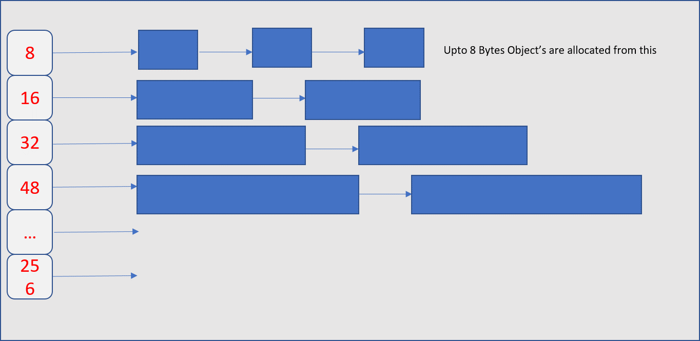
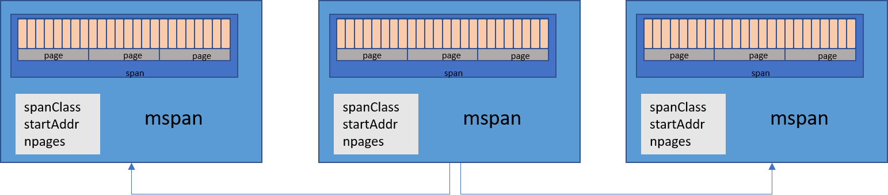

# golang快速入门[5.3]-go语言是如何运行的-内存分配

## 前文
* [golang快速入门[2.1]-go语言开发环境配置-windows](https://zhuanlan.zhihu.com/p/105462515)
* [golang快速入门[2.2]-go语言开发环境配置-macOS](https://zhuanlan.zhihu.com/p/105551487)
* [golang快速入门[2.3]-go语言开发环境配置-linux](https://zhuanlan.zhihu.com/p/105556890)
* [golang快速入门[3]-go语言helloworld](https://zhuanlan.zhihu.com/p/105776462)
* [golang快速入门[4]-go语言如何编译为机器码](https://zhuanlan.zhihu.com/p/106128892)
* [golang快速入门[5.1]-go语言是如何运行的-链接器](https://zhuanlan.zhihu.com/p/107495939)
* [golang快速入门[5.2]-go语言是如何运行的-内存概述](https://zhuanlan.zhihu.com/p/107495939)

## 前言
* 在上文中，我们对于内存、虚拟内存、程序等概念做了简单介绍
* 在本文中，我们将介绍内存分配以及go语言实现的内存分配方式

## 内存分配


* 在上文中，我们介绍了，从虚拟内存的角度，程序内存大致可以分为5个段`text`、`data`、`bss`、`stack`、`heap`
* 其中`text`段用于程序指令、文字、静态常量
* `data`与`bss`段用于存储全局变量
* `stack`段用于存储函数调用与函数内的变量，`stack`段的数据可以被CPU快速访问，`stack`段的大小在运行时是不能增加和减少的，销毁只是通过栈指针的移动来实现的。同时，这也是为什么程序有时候会报错stack overflow的原因。
* `stack`段的内存分配是编译器实现的，我们无需关心。同时stack通常的大小是有限的。
* 因此对于大内存的分配，或者想手动创建或释放内存，就只能够对`heap`段进行操作，这就是俗称的动态分配内存。例如c语言中的`malloc`、`calloc`、`free`以及C++中的`new`、`delete`
* 内存的分配属于操作系统级别的操作、因此不管是cc++语言的分配，最后都需要调用操作系统的接口。以linux为例，malloc代码可能调用了操作系统接口`mmap`分配内存
* linux操作系统提供的内存分配接口如下：
    + mmap/munmap   映射/释放 指定大小的内存.
    + brk/sbrk – 改变`data`段`结束的位置来扩展heap段的内存
    + madvise – 给操作系统建议如何管理内存
    + set_thread_area/get_thread_area – 操作线程本地存储空间
* 动态内存分配是操作系统为我们做的事情，其效率直接影响到运行在操作系统上的程序。对于一般的程序来说，例如c语言中实现的`malloc`,最后都是通过调用操作系统的接口来实现的。
* 动态内存的调度是一个艰难复杂的话题，其要实现的目标包括：
    + 快速分配和释放
    + 内存开销小
    + 使用所有内存
    + 避免碎片化
* 内存分配的算法包括了：
    + K&R malloc
    + Region-based allocator
    + Buddy allocator
    + dlmalloc
    + slab allocator
* 同时，由于算法解决的目标等不同，还会有不同的变种，其他的目标包括：
    + 内存开销小（例如buddy的元数据很大）
    + 良好的内存位置
    + cpu核心增加时，扩展性好
    + 并发malloc / free
* GO语言在进行动态内存分配时，实质调用了上面的操作系统接口。由于Go语言并没有调用c语言的`malloc`等函数来分配，组织内存，因此，其必须实现自己的内存组织和调度方式。
* GO语言借鉴了TCMalloc(Thread-Caching Malloc)的内存分配方式

## TCMalloc(Thread-Caching Malloc)
* TCMalloc是一种内存分配算法，比GNU C库中的malloc要快2倍，正如其名字一样，其是对于每一个线程构建了缓存内存。
* TCMalloc解决了多线程时内存分配的锁竞争问题
* TCMalloc对于小对象的分配非常高效
* TCMalloc的核心思想是将内存划分为多个级别，以减少锁的粒度。在TCMalloc内部，内存管理分为两部分：小对象内存（thread memory）和大对象内存（page heap）。
* 小对象内存管理将内存页分成多个固定大小的可分配的free列表。因此，每个线程都会有一个无锁的小对象缓存，这使得在并行程序下分配小对象（<= 32k）非常有效。下图的对象代表的是字节。



* 分配小对象时
    + 我们将在相同大小的线程本地free list中查找，如果有，则从列表中删除第一个对象并返回它
    + 如果free list中为空，我们从中央free list中获取对象（中央free list由所有线程共享），将它们放在线程本地free list中，并返回其中一个对象
    + 如果中央free list也为空，将从中央页分配器中分配`内存页`，并将其分割为一组相同大小的对象，并将新对象放在中央free list中。和之前一样，将其中一些对象移动到线程本地空闲列表中

* 大对象内存管理由`页`集合组成，将其称为`页堆（page heap）`当分配的对象大于32K时，将使用大对象分配方式。


* 第k个free list列表是包含k大小`页`的free list。第256个列表比较特殊，是长度大于等于256页的free list。
* 分配大对象时，对于满足k大小页的分配
    + 我们在第k个free list中查找
    + 如果该free list为空，则我们查找下一个更大的free list，依此类推，最终，如有必要，我们将查找最后一个空闲列表。如果更大的free list符合条件，则会进行内存分割以符合当前大小。
    + 如果失败，我们将从操作系统中获取内存。
* 内存是通过`连续页`（称为Spans）的运行来管理的（Go也根据Spans来管理内存）
* 在TCMalloc中，span有两种状态，已分配或是free状态。如果为free，则span是位于页堆列表中的一个。如果已分配，则它要么是已移交给应用程序的大对象，要么是已分成多个小对象的序列。


* go内存分配器最初是基于TCMalloc的

## go内存分配
* Go allocator与TCMalloc类似，内存的管理由一系列`页`（spans/mspan对象）组成，使用（线程/协程）本地缓存并根据内存大小进行划分。

#### mspan
* 在go语言中，Spans是8K或更大的连续内存区域。可以在`runtime/mheap.go`中对应的mspan结构
```
type mspan struct {
	next *mspan     // next span in list, or nil if none
	prev *mspan     // previous span in list, or nil if none
	list *mSpanList // For debugging. TODO: Remove.
	startAddr uintptr // address of first byte of span aka s.base()
	npages    uintptr // number of pages in span
	manualFreeList gclinkptr // list of free objects in mSpanManual spans
	freeindex uintptr
	nelems uintptr // number of object in the span.
	allocCache uint64
	allocBits  *gcBits
	gcmarkBits *gcBits
	sweepgen    uint32
	divMul      uint16        // for divide by elemsize - divMagic.mul
	baseMask    uint16        // if non-0, elemsize is a power of 2, & this will get object allocation base
	allocCount  uint16        // number of allocated objects
	spanclass   spanClass     // size class and noscan (uint8)
	state       mSpanStateBox // mSpanInUse etc; accessed atomically (get/set methods)
	needzero    uint8         // needs to be zeroed before allocation
	divShift    uint8         // for divide by elemsize - divMagic.shift
	divShift2   uint8         // for divide by elemsize - divMagic.shift2
	elemsize    uintptr       // computed from sizeclass or from npages
	limit       uintptr       // end of data in span
	speciallock mutex         // guards specials list
	specials    *special      // linked list of special records sorted by offset.
}

```




* 如上图，mspan是一个双向链接列表对象，其中包含页面的起始地址，它具有的页的数量以及其大小。

* mspan有三种类型，分别是：
    + idle：没有对象，可以释放回操作系统；或重新用于堆内存；或重新用于栈内存
    + in use：至少具有一个堆对象，并且可能有更多空间
    + stack：用于协程栈。可以存在于栈中，也可以存在于堆中，但不能同时存在于两者中。

#### mcache
* Go 像 TCMalloc 一样为每一个 逻辑处理器（P）（Logical Processors） 提供一个本地线程缓存（Local Thread Cache）称作 mcache，所以如果 Goroutine 需要内存可以直接从 mcache 中获取，由于在同一时间只有一个 Goroutine 运行在 逻辑处理器（P）（Logical Processors） 上，所以中间不需要任何锁的参与。mcache 包含所有大小规格的 mspan 作为缓存。


* 对于每一种大小规格都有两个类型：
    + scan -- 包含指针的对象。
    + noscan -- 不包含指针的对象。
* 采用这种方法的好处之一就是进行垃圾回收时 noscan 对象无需进一步扫描是否引用其他活跃的对象。

#### mcentral
* mcentral是被所有逻辑处理器共享的
* mcentral 对象收集所有给定规格大小的 span。每一个 mcentral 都包含两个 mspan 的列表：
    + empty mspanList -- 没有空闲对象或 span 已经被 mcache 缓存的 span 列表
    + nonempty mspanList -- 有空闲对象的 span 列表


* 每一个 mcentral 结构体都维护在 mheap 结构体内。

#### mheap
* Go 使用 mheap 对象管理堆，只有一个全局变量。持有虚拟地址空间。
* 就上我们从上图看到的：mheap 存储了 mcentral 的数组。这个数组包含了各个的 span 的 mcentral。
```
central [numSpanClasses]struct {
    mcentral mcentral
    pad      [unsafe.Sizeof(mcentral{})%sys.CacheLineSize]byte
}
```
* 由于我们有各个规格的 span 的 mcentral，当一个 mcache 从 mcentral 申请 mspan 时，只需要在独立的 mcentral 级别中使用锁，所以其它任何 mcache 在同一时间申请不同大小规格的 mspan 将互不受影响可以正常申请。
* pad为格外增加的字节。对齐填充（Pad）用于确保 mcentrals 以 CacheLineSize 个字节数分隔，所以每一个 MCentral.lock 都可以获取自己的缓存行（cache line），以避免伪共享（false sharing）问题。


* 图中对应的`free[_MaxMHeapList]mSpanList：一个 spanList 数组。每一个 spanList 中的 mspan 包含 1 ~ 127（_MaxMHeapList - 1）个页。例如，free[3] 是一个包含 3 个页的 mspan 链表。free 表示 free list，表示未分配。对应 busy list。
* freelarge mSpanList：一个 mspan 的列表，每一个元素(mspan)的页数大于 127，通过 mtreap 结构体管理。busylarge与之相对应。


* 在进行内存分配时，go按照大小分成3种对象类
    + 小于16个字节的对象Tiny类
    + 适用于最大32 kB的Small类
    + 适用于大对象的large类
* Small类会被分为大约有70个大小，每一个大小都拥有一个free list
* 引入Tiny这一微小对象是为了适应小字符串和独立的转义变量。
* Tiny微小对象将几个微小的分配请求组合到一个16字节的内存块中

* 当分配Tiny对象时：
    + 查看协程的mcache的相应tiny槽
    + 根据分配对象的大小，将现有子对象（如果存在）的大小四舍五入为8、4或2个字节
    + 如果当前分配对象与现有tiny子对象适合，请将其放置在此处
* 如果tiny槽未发现合适的块：
    + 查看协程的`mcache`中相应的`mspan`
    + 扫描`mspan`的`bitmap`以找到可用插槽
    + 如果有空闲插槽，对其进行分配并将其用作新的小型插槽对象（这一切都可以在不获取锁的情况下完成）
* 如果`mspan`没有可用插槽：
    + 从`mcentral`的所需大小类的`mspan`列表中获得一个新的`mspan`
* 如果`mspan`的列表为空：
    + 从`mheap`获取内存页以用于mspan
* 如果`mheap`为空或没有足够大的内存页
    + 从操作系统中分配一组新的页（至少1MB）
    + Go 会在操作系统分配超大的页（称作 arena），分配大量内存页将分摊与OS沟通的成本
* small对象分配与Tiny对象类似，
* 分配和释放大对象直接使用`mheap`，就像在TCMalloc中一样，管理了一组free list
* 大对象被四舍五入为页大小（8K）的倍数，在free list中查找第k个free list，如果其为空，则继续查找更大的一个free list，直到第128个free list
* 如果在第127个free list中找不到，我们在剩余的大内存页（`mspan.freelarge`字段）中查找跨度，如果失败，则从操作系统获取

## 总结
* Go 内存管理的一般思想是根据分配对象大小的不同，使用不同的内存结构构建不同的内存缓存级别。
* 将一个从操作系统接收的连续虚拟内存地址分割为多级缓存来减少锁的使用，同时根据指定的大小分配内存减少内存碎片以提高内存分配的效率和在内存释放之后加快 `垃圾回收`  的速度
* 下面是Go内存分配的直观表达


## 参考资料
* [项目链接](https://github.com/dreamerjackson/theWayToGolang)
* [作者知乎](https://www.zhihu.com/people/ke-ai-de-xiao-tu-ji-71)
* [blog](https://dreamerjonson.com/)
* [linux brk/sbrk](http://man7.org/linux/man-pages/man2/brk.2.html)
* [linux mmap/munmap](http://man7.org/linux/man-pages/man2/mmap.2.html)
* [linux set_thread_area/get_thread_area](http://man7.org/linux/man-pages/man2/set_thread_area.2.html)
* [TCMalloc : Thread-Caching Malloc](http://goog-perftools.sourceforge.net/doc/tcmalloc.html)
* [GO MEMORY MANAGEMENT](https://povilasv.me/go-memory-management/#fn-1784-10)