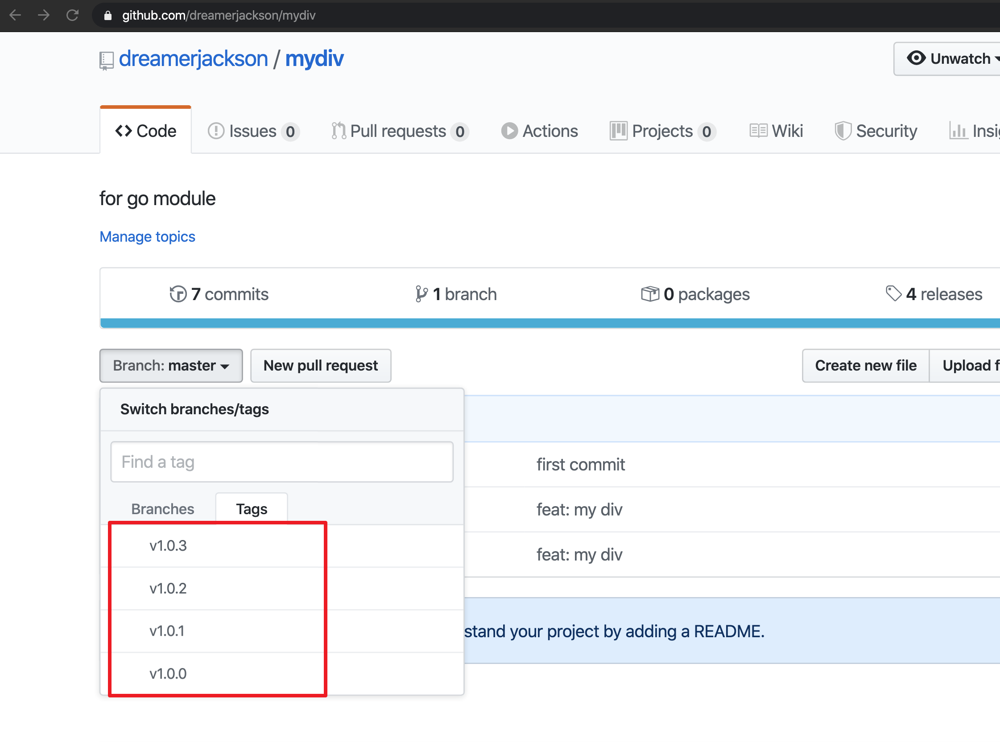
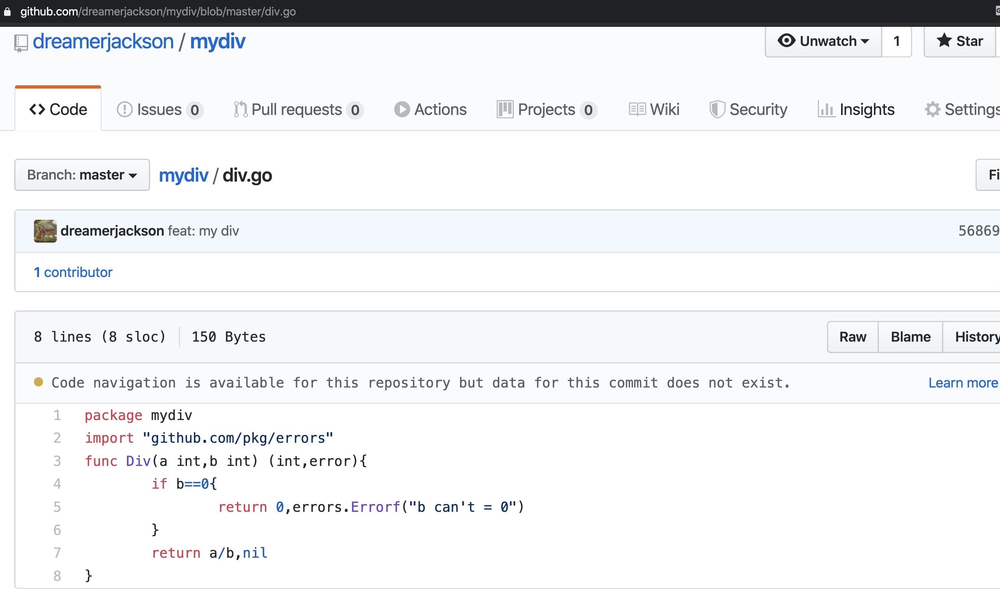
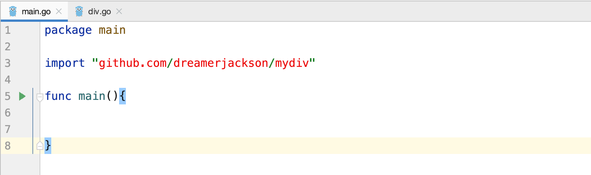

# golang快速入门[7.1]-项目与依赖管理-go module全面指南

## 前文
* [golang快速入门[1]-go语言导论](https://zhuanlan.zhihu.com/p/107658283)
* [golang快速入门[2.1]-go语言开发环境配置-windows](https://zhuanlan.zhihu.com/p/107659334)
* [golang快速入门[2.2]-go语言开发环境配置-macOS](https://zhuanlan.zhihu.com/p/107661202)
* [golang快速入门[2.3]-go语言开发环境配置-linux](https://zhuanlan.zhihu.com/p/107662649)
* [golang快速入门[3]-go语言helloworld](https://zhuanlan.zhihu.com/p/107664129)
* [golang快速入门[4]-go语言如何编译为机器码](https://zhuanlan.zhihu.com/p/107665043)
* [golang快速入门[5.1]-go语言是如何运行的-链接器](https://zhuanlan.zhihu.com/p/107665658)
* [golang快速入门[5.2]-go语言是如何运行的-内存概述](https://zhuanlan.zhihu.com/p/107807229)
* [golang快速入门[5.3]-go语言是如何运行的-内存分配](https://zhuanlan.zhihu.com/p/108598942)
* [golang快速入门[6.1]-集成开发环境-goland详解](https://zhuanlan.zhihu.com/p/109564120)
* [golang快速入门[6.2]-集成开发环境-emacs详解](https://zhuanlan.zhihu.com/p/110003756)
* [golang快速入门[7.1]-项目与依赖管理-gopath](https://zhuanlan.zhihu.com/p/110526009)

## 前言
* 在上文中，我们介绍了`gopath`的含义、功能、优劣、以及如何通过GOPATH来组织项目
* 在本文中，我们讲介绍`go module`的原理和用法以试图能够回答下面的几个问题
    + `go module`是什么？
    + `go module`为什么需要？
    + `go module`的基本使用方法是什么？
    + `go module`如何管理版本与依赖？
    + `go module`如何解决依赖的冲突问题？
    + `go module` 环境变量的配置与使用方式？
    +  如何搭建私有`module`镜像？
## `go module`诞生的背景 & 为什么需要`go module`
在`go module`之前,有一些问题长期困扰go语言的开发人员
* 能否将go工程代码脱离`gopath`之外
* 能否处理版本依赖问题并且自动选择最兼容的依赖版本
* 能否使用go工具本地管理依赖项,自定义依赖项
* go1.11开始支持，go1.13全面支持的`go modules` 正是为了解决上面的问题诞生的,下面我们详细介绍`go module`企图解决的问题
#### 解决`import` 路径问题
* 在介绍`gopath`时，我们介绍了如果导入为
```
import "github.com/gobuffalo/buffalo"
```
实际引用的是`$GOPATH/src/github.com/gobuffalo/buffalo` 文件中的代码。
* 也就是说,在`gopath`中 ，导入路径与项目在文件系统中的目录结构和名称必须是匹配的。
* 那么能否`import` 路径为`github.com/gobuffalo/buffalo`,但是项目实际的路径却是在另一个任意的文件目录中？(例如`/users/gobuffalo/buffalo`).答案是肯定的,`go module` 通过在一个特殊的叫做`go.mod`的文件中指定模块名来解决这一问题。
```
## go.mod
01 module github.com/gobuffalo/buffalo
02
...
06
```
在go.mod文件的第一行指定了模块名，模块名表示开发人员可以用此来引用当前代码仓库中任何`package`的路径名,以此来替代`$gopath`的路径。从而，代码仓库在任何位置都已经没有关系，因为Go工具可以使用模块文件的位置和模块名来解析代码仓库中的任何内部`import`。

#### 解决代码捆绑和版本控制
* 对于任何版本控制(VCS)工具，我们都能在任何代码提交点打上"tag"标记,如下所示：

* 使用VCS工具，开发人员可以通过引用特定标签将软件包的任何特定版本克隆到本地。
* 当我们引用一个第三方包时,可能并不总是希望应用项目最新的代码，而是某一个特定与当前项目兼容的代码。对于某一个项目来说，可能并没有意识到有人在使用他们的代码,或者某种原因进行了巨大的不兼容更新。
* 我们希望能够指明需要使用的第三方包的版本,并且go工具能够方便下载、管理。更棘手的是,一个第三方包A可能引用了其他的第三方包B，因此还必须把第三方包A的全部依赖下载。
    + 如何查找并把所有的依赖包下载下来？
    + 某一个包下载失败应该怎么办？
    + 所有项目之间如何进行依赖的传导？
    + 如何选择一个最兼容的包？
    + 如何解决包的冲突？
    + 如果希望在项目中同时引用第三方包的二个不同版本,需要如何处理？
* 因此，只通过`gopath`维护单一的master包的方式是远远不够的，因为依赖包的最新代码不一定与项目兼容。尽管go社区已经针对以上问题提供了一些解决方案（例如dep，godep，glide等）但是go官方的`go moudle`提供了一种集成解决方案，通过在文件中维护直接和间接依赖项的版本列表来解决这一问题。通过将一个特定版本的依赖项看做是捆绑的不可变的依赖项，就叫做一个模块（moudle）

## go moudle 优势
* 提供脱离`gopath`管理go代码的优势
* 提供了代码捆绑、版本控制、依赖管理的功能
* 供全球开发人员使用、构建，下载，授权、验证，获取，缓存和重用模块（可以通过搭建自己的代理服务器来实现这些功能）
* 可以验证模块（对于任何给定的版本）始终包含完全相同的代码，而不管它被构建了多少次，从何处获取以及由谁获取


## go moudle 使用

#### Module缓存
为了加快构建程序的速度并快速切换、获取项目中依赖项的更新，Go维护了下载到本地计算机上的所有模块的缓存，缓存目前默认位于`$GOPATH/pkg`目录中。有[go的提议](https://github.com/golang/go/issues/34527)希望能够自定义缓存的位置。
所在位置看上去如下所示:
```
go/
├── bin
├── pkg
     ├── darwin_amd64
     └── mod
└── src

```

在mod目录下，我们能够看到模块名路径中的第一部分用作了模块缓存中的顶级文件夹
```
~/go/pkg/mod » ls -l                                                                                                                                                                                jackson@192
drwxr-xr-x    6 jackson  staff    192  1 15 20:50 cache
drwxr-xr-x    7 jackson  staff    224  2 20 17:50 cloud.google.com
drwxr-xr-x    3 jackson  staff     96  2 18 12:03 git.apache.org
drwxr-xr-x  327 jackson  staff  10464  2 28 00:02 github.com
drwxr-xr-x    8 jackson  staff    256  2 20 17:27 gitlab.followme.com
drwxr-xr-x    6 jackson  staff    192  2 19 22:05 go.etcd.io
...
```
当我们打开一个实际的模块,例如`github.com/nats-io`,我们会看到与nats库有关许多模块
```
~/go/pkg/mod » ls -l github.com/nats-io                                                                                                                                                             jackson@192
total 0
dr-x------  24 jackson  staff   768  1 17 10:27 gnatsd@v1.4.1
dr-x------  15 jackson  staff   480  2 17 22:22 go-nats-streaming@v0.4.0
dr-x------  26 jackson  staff   832  2 19 22:05 go-nats@v1.7.0
dr-x------  26 jackson  staff   832  1 17 10:27 go-nats@v1.7.2
...
```
为了拥有一个干净的工作环境，我们可以用如下代码清空缓存区。但是请注意，在正常的工作流程中,是不需要执行如下代码的。
```
$ go clean -modcache
```

#### 开始一个新的项目
我们从`GOPATH`外开始一个新的项目讲解,新建一个新建夹以及一个`main文件。
```
$ cd $HOME
$ mkdir mathlib
$ cd mathlib                                                                                                                                                                                 jackson@192
$ touch main.go
```
接着在当前目录中,执行如下指令初始化moudle。
```
~/mathlib » go mod init github.com/dreamerjackson/mathlib
```
* `go mod init`指令的功能很简单,自动生成一个`go.mod`文件 后面紧跟的路径即是自定义的模块名。习惯上以托管代码仓库的URL为模块名（代码将会放置在`https://github.com/dreamerjackson/mathlib`下）
* `go.mod`文件 位于项目的根目录下,内容如下所示，第一行即为模块名。
```
module github.com/ardanlabs/service

#### 引入第三方模块
go 1.13
```
* 接下来我们将书写初始化的代码片段
```
package main

import "github.com/dreamerjackson/mydiv"

func main(){


}
```

* 我们在代码片段中导入了为了讲解`go moudle`而特地的引入的package`github.com/dreamerjackson/mydiv`，其进行简单的除法操作，同时又引入了另一个包`github.com/pkg/errors`。其代码如下图所示:


* 如下图所示，在goland中我们可以看到导入的package 是红色的，因为此时在go module的缓存并不能找到此package。

#### 下载第三方模块
* 为了能够将此package下载到本地，我们可以使用`go mod tidy`指令
```
$ go mod tidy
go: finding github.com/dreamerjackson/mydiv latest
go: downloading github.com/dreamerjackson/mydiv v0.0.0-20200305082807-fdd187670161
go: extracting github.com/dreamerjackson/mydiv v0.0.0-20200305082807-fdd187670161
```

同时我们在`go.mod`中能够看到新增加了一行用于表示我们引用的依赖关系
```
module github.com/dreamerjackson/mathlib

go 1.13

require github.com/dreamerjackson/mydiv v0.0.0-20200305082807-fdd187670161

```

* 注意在这里间接的依赖（即`github.com/dreamerjackson/mydiv` 依赖的`github.com/pkg/errors`）并没有也没有必要在`go.mod`文件展示出来，而是出现在了一个自动生成的新的文件`go.sum`中.
```
## go.sum
github.com/dreamerjackson/mydiv v0.0.0-20200305082807-fdd187670161 h1:QR1fJ05yjzJ0qv1gcUS+gAe5Q3UU5Y0le6TIb2pcJpQ=
github.com/dreamerjackson/mydiv v0.0.0-20200305082807-fdd187670161/go.mod h1:h70Xf3RkhKSNbUF8W3htLNJskYJSITf6AdEGK22QksQ=
github.com/pkg/errors v0.9.1 h1:FEBLx1zS214owpjy7qsBeixbURkuhQAwrK5UwLGTwt4=
github.com/pkg/errors v0.9.1/go.mod h1:bwawxfHBFNV+L2hUp1rHADufV3IMtnDRdf1r5NINEl0=

```
#### 使用第三方模块

* 接着就可以愉快的调用我们的代码了
```
package main

import (
	"fmt"
	"github.com/dreamerjackson/mydiv"
)

func main(){
	res,_ :=mydiv.Div(4,2)
	fmt.Println(res)
}
```
* 运行`go run` 命令后，即会为我们输出除法结果`2`

#### 手动跟新第三方模块
* 假设我们依赖的第三方包出现了跟新怎么办？如果将依赖代码更新到最新的版本呢？
* 有多种方式可以实现依赖模块的更新，在`go.mod`文件中修改版本号为：
```
require github.com/dreamerjackson/mydiv latest
```
或者
```
require github.com/dreamerjackson/mydiv master
```
获取复制commitId 到最后
```
require github.com/dreamerjackson/mydiv c9a7ffa8112626ba6c85619d7fd98122dd49f850
```
还有一种办法是在终端当前项目中，运行`go get`
```
go get github.com/dreamerjackson/mydiv
```
* 上述几种方式在保存文件后，再次运行`go mod tidy`即会进行更新

此时如果我们再次打开`go.sum`文件会发现，`go.sum`中不仅仅存储了直接和间接的依赖，还会存储过去的版本信息。
```
github.com/dreamerjackson/mydiv v0.0.0-20200305082807-fdd187670161 h1:QR1fJ05yjzJ0qv1gcUS+gAe5Q3UU5Y0le6TIb2pcJpQ=
github.com/dreamerjackson/mydiv v0.0.0-20200305082807-fdd187670161/go.mod h1:h70Xf3RkhKSNbUF8W3htLNJskYJSITf6AdEGK22QksQ=
github.com/dreamerjackson/mydiv v0.0.0-20200305090126-c9a7ffa81126/go.mod h1:h70Xf3RkhKSNbUF8W3htLNJskYJSITf6AdEGK22QksQ=
github.com/pkg/errors v0.9.1 h1:FEBLx1zS214owpjy7qsBeixbURkuhQAwrK5UwLGTwt4=
github.com/pkg/errors v0.9.1/go.mod h1:bwawxfHBFNV+L2hUp1rHADufV3IMtnDRdf1r5NINEl0=

```

#### 依赖移除
当我们不想在使用此第三方包时，可以直接在代码中删除无用的代码，接着执行
```
$ go mod tidy
```
会发现`go.mod` 与`go.sum` 一切又都空空如也~

## go module 最小版本选择原理
* 每个依赖管理解决方案都必须解决选择依赖版本的问题,当今存在的许多版本选择算法都试图识别任何依赖的“最新最大”版本。如果您认为语义版本控制被正确应用并且将遵守约定，那么这是有道理的。在这些情况下，依赖项的“最新最大”版本应该是最稳定和安全的版本，并且应与较早版本具有向后兼容性。
* Go决定采用其他方法,Russ Cox花费了大量时间和精力[撰写](https://research.swtch.com/vgo)和谈论 Go团队的版本选择方法，即最小版本选择(Minimal Version Selection,MVS)。从本质上讲，Go团队相信MVS可以为Go程序提供最佳的机会，以实现长期的持久性和可复制性。我建议阅读[这篇文章](https://dreamerjonson.com/)，以了解Go团队为什么相信这一点。
#### 什么是最小版本选择原理
* go最小版本选择指的是选择项目中最合适的最小版本。并不是说MVS不能选择最新的版本，而是如果项目中任何依赖不需要最新的版本,则不需要它。
* 举一个简单的例子，假设现在项目`github.com/dreamerjackson/mydiv`的最新版本为`v1.0.2`,可通过下面指令查看所有
```
> go list -m -versions github.com/dreamerjackson/mydiv
github.com/dreamerjackson/mydiv v1.0.0 v1.0.1 v1.0.2 v1.0.3
```
假设现在有两个模块A、B，都依赖模块D。其中
```
A -> D v1.0.1,
B -> D v1.0.2
```

* 如果我们的当前项目只依赖A,这个时候`go module`会如何选择呢？像dep这样的依赖工具将选择v1.0.3,即最新的语义版本控制。但是在`go module`中，最小版本选择原理将遵循A项目声明的版本，即v1.0.1
* 如果随后当前项目又引入了模块B的新代码怎么办？将模块B导入项目后，Go会将项目的模块D版本从v1.0.1升到v1.0.2。为模块D的所有依赖项（模块A和B）选择模块D的“最小”版本，该版本当前处于所需版本集（v1.0.1和v.1.0.2）中
* 最后，如果删除刚刚为模块B添加的代码，会发生什么？Go会将项目锁定到模块D的版本v1.0.2中。降级到版本v1.0.1将是一个更大的更改，而Go知道版本v1.0.1可以正常运行并且稳定，因此版本v1.0.2仍然是“最新版本”。
#### 验证最小版本选择原理
* 为了验证最小版本选择原理，作者呕心沥血设计了一个简单的示例。
以项目`github.com/dreamerjackson/mydiv`为例,读者可以将其看做上节中的`模块D`，其`v1.0.1`与`v1.0.2`版本的代码如下，只是简单的改变了错误返回的字符串。
```
## v1.0.1
package mydiv
import "github.com/pkg/errors"
func Div(a int,b int) (int,error){
	if b==0{
		return 0,errors.Errorf("new error b can't = 0")
	}
	return a/b,nil
}

## v1.0.2
package mydiv
import "github.com/pkg/errors"
func Div(a int,b int) (int,error){
	if b==0{
		return 0,errors.Errorf("new error b can't = 0")
	}
	return a/b,nil
}
```

* 接着`模块B`即`github.com/dreamerjackson/minidiv` 引用了模块D即`github.com/dreamerjackson/mydiv` v1.0.1版本
```
## 模块B
package div

import (
	"github.com/dreamerjackson/mydiv"
)

func Div(a int,b int) (int,error){
	return mydiv.Div(a,b)
}
```
* 最后当前的项目,我们将其称为`模块Now`直接依赖了模块D v1.0.2，同时依赖了模块B
* 当前代码如下:
```
package main

import (
	"fmt"
	div "github.com/dreamerjackson/minidiv"
	"github.com/dreamerjackson/mydiv"
)

func main(){
	_,err1:= mydiv.Div(4,0)
	_,err2 := div.Div(4,0)
	fmt.Println(err1,err2)
}
```
当前的依赖关系如下:
```
当前模块 --> 模块D v1.0.2
当前模块 --> 模块B --> 模块D v1.0.1
```

* 因此我们将验证，是否和我们所料，当前项目选择了模块D v1.0.2 呢？
* 验证方式有两种：第一种为直接运行，查看项目采用了哪一个版本的代码
```
$ go run main.go
v1.0.2 b can't = 0 v1.0.2 b can't = 0
```
* 如上所示，输出的结果全部是我们在模块D v1.0.2中定义的代码！
* 第二种方式是使用`go list`指令
```
~/mathlib » go list -m all | grep mydiv
github.com/dreamerjackson/mydiv v1.0.2
```
我们还可以通过使用`go mod mhy` z指令，查看在哪里引用了包`github.com/dreamerjackson/mydiv`
```
~/mathlib » go mod why github.com/dreamerjackson/mydiv
# github.com/dreamerjackson/mydiv
github.com/dreamerjackson/mathlib
github.com/dreamerjackson/mydiv

```
#### 查看直接和间接模块的当前和最新版本
* 我们可以使用`go list -m -u all` 指令查看直接和间接模块的当前和最新版本
```
~/mathlib » go list -m -u all | column -t                                                                                                                                                           jackson@192
go: finding github.com/dreamerjackson/minidiv latest
github.com/dreamerjackson/mathlib
github.com/dreamerjackson/minidiv  v0.0.0-20200305104752-fcd15cf402bb
github.com/dreamerjackson/mydiv    v1.0.2                              [v1.0.3]
github.com/pkg/errors              v0.9.1
```
* 如上所示，我们可以看到`github.com/dreamerjackson/mydiv`的当前版本为`v1.0.2`,但是最新的版本为`v1.0.3`

#### 更新直接和间接模块
* 获取直接和间接模块可以使用`go get`指令。其中有不少的参数。
* 下面命令以`最小版本原则`更新所有的直接和间接模块
```
go get -t -d -v  ./...
```
* `-t` 考虑构建测试所需的模块
* `-d` 下载每个模块的源代码
* `-v` 提供详细输出
* `./...` 在整个源代码树中执行这些操作，并且仅更新所需的依赖项
* 注意,除非你了解项目的所有细节，否则慎用全部的最大最新版本的跟新

* 如果go get中使用`-u`参数会用`最大最新版本`原则更新所有的直接和间接模块
```
~/mathlib » go get -u -t -d -v ./...                                                                                                                                                                jackson@192
go: finding github.com/dreamerjackson/minidiv latest
go: downloading github.com/dreamerjackson/mydiv v1.0.3
go: extracting github.com/dreamerjackson/mydiv v1.0.3
```

* 接着我们可以再次查看当前引用的版本,我们会发现模块`github.com/dreamerjackson/mydiv`已经强制更新到了最新的v1.0.3
```
~/mathlib » go list -m all | grep mydiv                                                                                                                                                             jackson@192
github.com/dreamerjackson/mydiv v1.0.3
```
#### 重置依赖关系
* 如果您不满意所选的模块和版本，则始终可以通过删除`go.mod go.sum`模块文件并再次运行go mod tidy来重置。当项目还不太成熟时这是一种选择。
```
$ rm go.*
$ go mod init <module name>
$ go mod tidy
```

##  模块镜像（Module Mirror）
模块镜像于2019年八月推出，是go官方1.13版本的默认系统。模块镜像是一个代理服务器，以帮助加快构建本地应用程序所需的模块的获取。代理服务器实现了基于REST的API，并根据Go工具的需求进行了设计。
模块镜像将会缓存已请求的模块及其特定版本，从而可以更快地检索将来的请求。一旦代码被获取并缓存在模块镜像中，就可以将其快速提供给世界各地的用户。

## checksum数据库
checksum数据库也于2019八月推出，是可以用来防止模块完整性、有效性的手段。它验证特定版本的任何给定模块的代码是相同的，而不管是谁，在哪里，在哪个时候以及是如何获取的。Google拥有唯一的校验和数据库，但是可以通过私有模块镜像对其进行缓存。

## go module 环境变量
有几个环境变量可以控制与模块镜像和checksum数据库有关的行为
* GOPROXY：一组指向模块镜像的URL，用于获取模块。如果您希望Go工具仅直接从VCS地址获取模块，则可以将其设置为`direct`。如果将此设置为`off`，则将不会下载模块
* GOSUMDB：用于验证给定模块/版本的代码的checksum数据库地址。此地址用于形成一个适当的URL，该URL告诉Go工具在哪里执行这些checksum校验和查找。该URL可以指向Google拥有的checksum数据库，也可以指向支持对checksum数据库进行缓存或代理的本地模块镜像。如果您不希望Go工具验证添加到go.sum文件中的给定模块/版本的哈希码，也可以将其设置为off,仅在将任何新module
行添加到go.sum文件之时，才查询checksum数据库
* GONOPROXY：一组基于URL的模块路径，这些模块不会使用模块镜像来获取，而应直接在VCS地址上获取。
* GONOSUMDB：一组基于URL的模块路径，这些模块的哈希码不会在checksum数据库中查找。
* GOPRIVATE：一个方便变量，用于将GONOPROXY和GONOSUMDB设置为相同的默认值
我们可以通过`go env` 来查看到这些默认值
```
$ go env
GONOPROXY=""
GONOSUMDB=""
GOPRIVATE=""
GOPROXY="https://proxy.golang.org,direct"
GOSUMDB="sum.golang.org"
```
* 这些默认值告诉Go工具使用Google模块镜像和Google checksum数据库。如果这些Google服务可以访问您所需的所有代码，则建议使用此配置。如果Google模块镜像恰好以410（消失）或404（未找到）响应，则使用direct（这是GOPROXY配置的一部分）将允许Go工具更改路线并直接获取模块/版本VCS位置。
* 例如，如果我们需要访问所有代理服务器,例如需要权限的位于`gitlab` 等地的代码,我们可以使用`export GOPRIVATE=gitlab.XXX.com,gitlab.XXX-XX.com,XXX.io` 多个域名用逗号分隔。

## Athens搭建私有模块镜像
[Athens](https://docs.gomods.io/)是一个私有模块镜像，可以用于搭建私有模块镜像。使用私有模块镜像的一个原因是允许缓存公共模块镜像无法访问的私有模块。Athens项目提供了一个在`Docker Hub`上发布的`Docker`容器，因此不需要特殊的安装。
```
docker run -p '3000:3000' gomods/athens:latest
```
接下来，启动一个新的终端会话以运行Athens，为大家演示其用法。启动Athens服务并通过额外的参数调试日志（请确保系统已经安装并启动了docker）并有科学*上网的环境

```
$ docker run -p '3000:3000' -e ATHENS_LOG_LEVEL=debug -e GO_ENV=development gomods/athens:latest
INFO[7:11AM]: Exporter not specified. Traces won't be exported
2020-03-06 07:11:30.671249 I | Starting application at port :3000
```

* 接着我们修改GOPROXY参数，指向本地`3000`端口，初始化我们之前的项目，再次执行`go mod tidy`
```
$ export GOPROXY="http://localhost:3000,direct"
$ rm go.*
$ go mod init github.com/dreamerjackson/mathlib
$ go mod tidy
```
在Athens日志中即可查看对应信息
```
INFO[7:39AM]: incoming request	http-method=GET http-path=/github.com/dreamerjackson/mydiv/@v/list http-status=200
INFO[7:39AM]: incoming request	http-method=GET http-path=/github.com/dreamerjackson/minidiv/@v/list http-status=200
INFO[7:39AM]: incoming request	http-method=GET http-path=/github.com/dreamerjackson/minidiv/@latest http-status=200
```
* 详细信息，查看参考资料中Athens的官方网站

## 总结

## 参考资料
* [项目链接](https://github.com/dreamerjackson/theWayToGolang)
* [作者知乎](https://www.zhihu.com/people/ke-ai-de-xiao-tu-ji-71)
* [blog](https://dreamerjonson.com/)
* [Athens](https://docs.gomods.io/)
* [talk youtube](https://www.youtube.com/watch?v=F8nrpe0XWRg)
* [How to Write Go Code (with GOPATH)](https://golang.org/doc/gopath_code.html)
* [How to Write Go Code ](https://golang.org/doc/code.html#Organization)